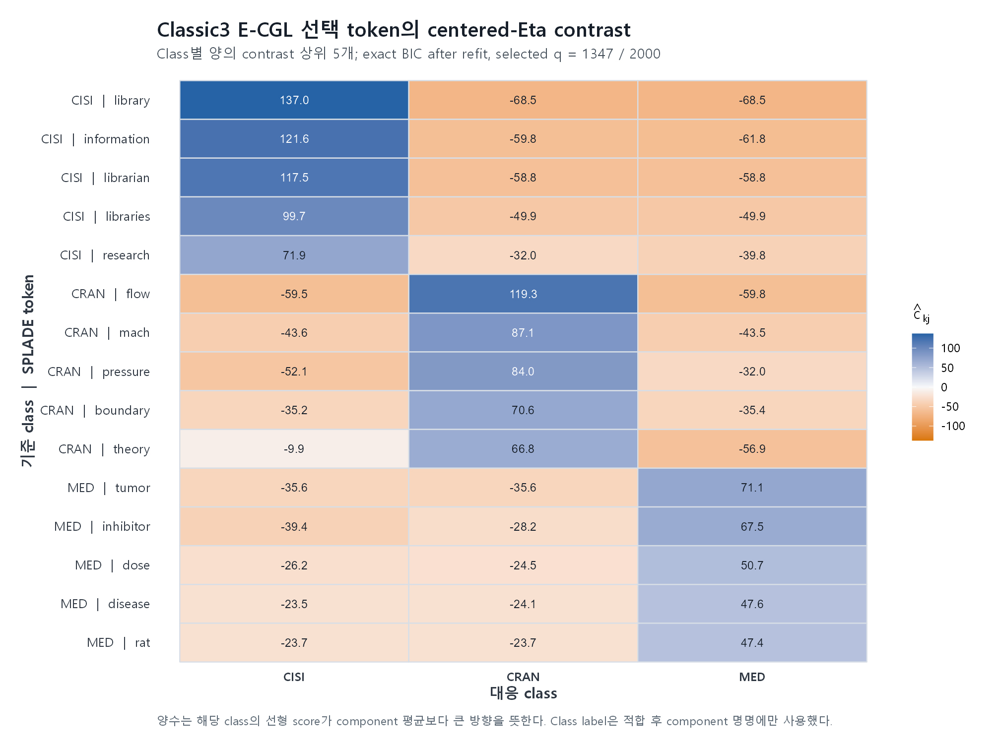
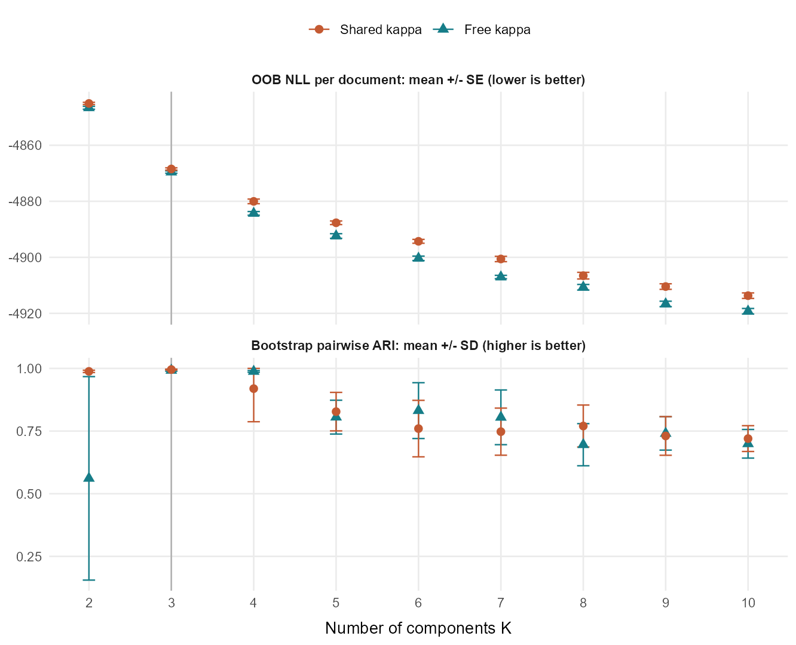

# 실자료 분석 결과: Classic3 주 분석과 적용 범위

## 1. 핵심 결과

실자료의 주 분석은 **Classic3 SPLADE top-2000**으로 구성하였다. E-CGL은 2,000개 좌표 중 1,347개를 선택하여 32.7%를 제거하면서 dense free-$\kappa_k$ vMF와 같은 test ARI 0.9927과 NMI 0.9863을 유지하였다. 반복 재선택에서 Nogueira stability는 0.884였다.

따라서 Classic3 결과는 E-CGL이 군집 배정을 유지하면서 posterior decision coordinate를 안정적으로 축약한 사례로 보고한다. 선택된 좌표도 CISI의 `library`, CRAN의 `flow`, MED의 `tumor`처럼 class별 주제와 연결되는 token으로 확인되었다. 선택 비율은 67.4%이므로 극희소 support가 아니라 **해석 가능한 중간 밀도의 decision support**로 해석한다. E-ACGL은 E-CGL과 거의 같은 결과를 보여 adaptive 보조 모형으로 둔다.

| 자료 | 문서 내 역할 | 핵심 결과 |
|---|---|---|
| **Classic3** | **주 실자료 분석** | E-CGL이 좌표 32.7%를 제거하고 dense vMF와 같은 test ARI 유지 |
| BBC5 | 부록: 강건성 및 희소화 비용 | 좌표 축약과 함께 ARI와 test density가 감소 |
| CSTR | 부록: 문헌 재현 및 적용 한계 | Rossi M-L이 E-CGL/E-ACGL보다 높은 ARI 기록 |

## 2. Classic3 주 분석

### 2.1 데이터 표현과 SPLADE 선택

Classic3는 CISI, CRAN, MED 초록 3,890건으로 구성된다. 문맥 기반 lexical expansion과 coordinate-level 해석을 함께 유지하기 위해 SPLADE 표현을 사용하였다.

| 문서 표현 | 장점 | E-CGL 분석에서의 제약 |
|---|---|---|
| TF-IDF | 관측 token에 직접 대응 | 동의어·관련어 등 문맥 기반 확장을 반영하지 못함 |
| Dense LLM embedding | 문서의 의미적 유사성을 압축 | 좌표가 latent dimension이므로 선택 좌표를 token으로 해석하기 어려움 |
| **SPLADE** | pretrained language model의 문맥 정보를 vocabulary-aligned sparse weight로 표현 | expansion token이 원문에 그대로 등장하지 않을 수 있음 |

SPLADE는 일반적인 dense LLM embedding이 아니라 **pretrained language model 기반 sparse lexical representation**이다. 각 좌표가 vocabulary token에 대응하므로, E-CGL이 선택한 coordinate를 다시 token으로 제시할 수 있다. 동시에 학습된 lexical expansion을 통해 단순 exact term matching보다 넓은 문맥 정보를 반영한다. 이 구조는 [Formal, Piwowarski, and Clinchant (2021)](https://arxiv.org/abs/2107.05720)의 sparse lexical and expansion representation에 기반한다.

SPLADE 좌표 중 train 자료에서 분산이 큰 2,000개를 선택하고, 층화 분할한 train 3,111건과 test 779건에 같은 vocabulary를 적용하였다. 모든 문서는 단위 $L_2$ 노름으로 정규화하여 vMF mixture의 구면 자료 조건에 맞췄다.

제공된 주제 라벨은 train/test 분할과 ARI/NMI 평가에만 사용하였으며, 좌표 선택·초기화·모수 추정에는 사용하지 않았다. E-CGL과 E-ACGL은 train path의 각 고유 support에서 full fixed-support numerical refit을 수행한 후 BIC로 선택하였다.

### 2.2 Held-out 성능

| 방법 | 선택 기준 | selected $q$ | support 비율 | test NLL/document | test ARI | test NMI |
|---|---|---:|---:|---:|---:|---:|
| Spherical $k$-means | cosine objective | 2,000 | 1.000 | NA | 0.9856 | 0.9710 |
| Dense vMF, shared $\kappa$ | unpenalized | 2,000 | 1.000 | -4871.6918 | 0.9856 | 0.9710 |
| Dense vMF, free $\kappa_k$ | unpenalized | 2,000 | 1.000 | **-4872.9015** | **0.9927** | **0.9863** |
| M-L | BIC before refit | 2,000 | 1.000 | -4871.0937 | 0.9892 | 0.9787 |
| **E-CGL** | BIC after full support refit | **1,347** | **0.674** | -4872.2942 | **0.9927** | **0.9863** |
| E-ACGL | BIC after full support refit | 1,348 | 0.674 | -4872.2981 | 0.9927 | 0.9863 |

E-CGL의 test NLL은 dense free-$\kappa_k$ vMF보다 문서당 0.6073 높았다. 이는 predictive density의 최댓값보다 군집 배정을 유지하는 좌표 축약에 해당한다. E-ACGL은 support 크기와 held-out 성능에서 E-CGL을 개선하지 않았다.

Held-out negative log-likelihood는 $-n_{\mathrm{test}}^{-1}\sum_i\log \widehat p(x_i)$로 계산하였다. vMF는 연속 밀도이므로 값이 음수일 수 있으며, 작은 값이 더 높은 test density를 뜻한다.

### 2.3 Support 안정성

Train 자료의 80%를 다시 추출하고 전체 path에서 support를 재선택하는 절차를 20회 반복하였다.

| 방법 | selected $q$, 평균 (SD) | ARI 평균 | Nogueira stability | 평균 support Jaccard |
|---|---:|---:|---:|---:|
| **E-CGL** | 1343.9 (16.8) | 0.9740 | 0.884 | 0.927 |
| E-ACGL | 1345.4 (10.2) | 0.9744 | 0.887 | 0.928 |

두 방법 모두 support 크기와 선택 좌표가 반복 표본에서 유사하게 유지되었다. Classic3에서는 E-CGL을 주 결과로 보고하고 E-ACGL은 adaptive sensitivity로 제시한다.

### 2.4 선택 좌표의 해석

E-CGL에서 token $j$의 class별 해석값은

$$
\widehat c_{kj}
=\widehat\eta_{kj}-\frac{1}{K}\sum_{\ell=1}^{K}\widehat\eta_{\ell j}
$$

이다. SPLADE weight는 $x_j\ge 0$이므로 $\widehat c_{kj}>0$이고 $x_j>0$이면 해당 좌표의 기여 $\widehat c_{kj}x_j$가 class $k$의 선형 posterior score를 component 평균보다 높이는 방향으로 작용한다.

$$
(\widehat\eta_k-\bar{\widehat\eta})^\top x
=\sum_{j=1}^{d}\widehat c_{kj}x_j,
\qquad x_j\ge 0.
$$

| 대응 class | 양의 centered-$\eta$ contrast 상위 token |
|---|---|
| CISI | library, information, librarian, libraries, research |
| CRAN | flow, mach, pressure, boundary, theory |
| MED | tumor, inhibitor, dose, disease, rat |

CISI는 정보검색·도서관, CRAN은 유체·공학, MED는 의생명 관련 token이 상위에 나타났다. 같은 token이 다른 class에서는 음의 contrast를 보여, 단순 출현 빈도가 아니라 component 간 상대적 decision contribution으로 해석할 수 있다. Class label은 모형 적합에 사용하지 않고 적합 후 component 명명에만 사용하였다.

그림의 행은 class별 양의 contrast 상위 5개 token이고, 열은 적합 후 대응시킨 CISI·CRAN·MED component다. 파란색은 양의 contrast, 주황색은 음의 contrast를 나타낸다. SPLADE token은 pretrained model이 확장한 lexical feature일 수 있으므로 원문에 반드시 그대로 등장하는 단어로 한정하지 않는다.

## 3. 부록 A. 적용 범위 점검

### A.1 BBC5: 좌표 축약에 따른 성능 비용

BBC5는 중복 기사 101건을 분할 전에 제거한 2,124건의 5개 주제 기사 자료다. Train 1,697건에서 선택한 SPLADE top-1,000 좌표를 test 427건에 적용하였다.

| 방법 | selected $q$ | test NLL/document | test ARI | test NMI |
|---|---:|---:|---:|---:|
| Dense vMF, free $\kappa_k$ | 1,000 | **-2126.2275** | **0.8959** | **0.8736** |
| M-L | 1,000 | -2124.8031 | 0.8889 | 0.8667 |
| E-CGL | **679** | -2124.7525 | 0.8849 | 0.8615 |
| E-ACGL | 691 | -2124.8671 | 0.8849 | 0.8615 |

E-CGL은 좌표의 32.1%를 제거했지만 dense free-$\kappa_k$ vMF보다 test ARI가 0.0109 낮고 test NLL이 문서당 1.4750 높았다. BBC5에서는 군집 구분 정보가 선택된 centered-$\eta$ support에 충분히 집중되지 않아, 좌표 축약이 군집·밀도 적합의 손실을 동반한 것으로 해석된다. E-ACGL도 이 손실을 줄이지 못했다.

### A.2 CSTR: prototype-oriented support가 유리한 사례

CSTR은 475개 컴퓨터과학 기술보고서 초록을 1,000개 이진 단어 좌표로 표현한 자료다. Rossi and Barbaro (2022)의 분석 조건에 맞춰 50회 반복하였다.

| 방법 | 단계 | selected $q$ 평균 | ARI 평균 (SD) | NMI 평균 |
|---|---|---:|---:|---:|
| Dense shared-$\kappa$ vMF | dense | 1,000.0 | 0.8023 (0.0087) | 0.7650 |
| **Rossi M-L** | penalized | 888.7 | **0.8083 (0.0079)** | **0.7703** |
| E-CGL | refit | 311.1 | 0.6153 (0.0065) | 0.6449 |
| E-ACGL | refit | 313.3 | 0.6066 (0.0109) | 0.6401 |

현재 구현은 논문의 dense shared-$\kappa$ vMF ARI 0.804와 M-L ARI 0.808을 각각 0.8023과 0.8083으로 근접하게 재현하였다. 반면 E-CGL은 평균 311.1개 좌표를 선택한 뒤 ARI가 0.6153으로 감소하였다.

이 결과는 CSTR의 이진 어휘 구조가 sparse posterior decision support보다 dense 또는 prototype-oriented support와 더 잘 맞는다는 해석과 일관된다. 또한 $n=475$에 비해 $d=1{,}000$인 조건은 centered contrast support 추정에 불리하게 작용할 수 있다.

### A.3 해석 범위

| 자료 | 관찰된 한계 | 결과가 시사하는 구조 |
|---|---|---|
| BBC5 | 좌표 축약 후 ARI·NLL 감소 | decision 정보가 여러 좌표에 분산된 중간·조밀 support 가능성 |
| CSTR | E-CGL/E-ACGL의 강한 축약과 ARI 감소 | sparse prototype 또는 dense 어휘 support가 더 적합할 가능성 |

두 자료 모두 true feature support를 제공하지 않는다. 따라서 위 설명은 관찰된 성능 차이에 대한 구조적 해석이며, 자료 생성 원인을 식별한 결과는 아니다.

## 4. 부록 B. $K$ 선택과 component 해상도 진단

주 support 비교에서는 Classic3의 세 주제 범주에 맞춰 $K=3$을 고정하였다. 별도 진단에서는 라벨을 사용하지 않고 dense vMF를 $K=2,\ldots,10$에 적합한 뒤, 정보지수·conditional out-of-bag(OOB) density·bootstrap partition stability를 비교하였다. 외부 주제 라벨은 모형 적합과 $K$ 진단이 끝난 뒤 ARI와 NMI 계산에만 사용하였다.

Bootstrap 초기값은 각 in-bag 표본에서만 추정하였다. 다만 SPLADE top-2,000 vocabulary는 전체 train 자료에서 미리 고정했으므로 OOB 결과는 이 표현에 조건부인 진단이다.

| $\kappa$ 모형 | BIC | RICc | EBIC$_{0.5}$ | EBIC$_1$ | conditional OOB NLL 1-SE | bootstrap stability |
|---|---:|---:|---:|---:|---:|---:|
| shared $\kappa$ | 10 | 8 | 8 | 8 | 10 | **3** |
| free $\kappa_k$ | 10 | 7 | 9 | 7 | 10 | **3** |

Likelihood와 OOB density는 후보 범위의 상단을 선호한 반면, bootstrap partition stability는 두 $\kappa$ 모형에서 모두 $K=3$에서 최대였다. Bootstrap 결과는 $B=10$의 탐색적 진단이다.

E-CGL은 대표 후보 $K=3,7,8,10$에서 각각 path를 적합하고, full fixed-support numerical refit 후 BIC로 support를 선택하였다.

| $K$ | selected $q$ | test NLL/document | test ARI | purity | homogeneity | completeness |
|---:|---:|---:|---:|---:|---:|---:|
| **3** | 1,347 | -4872.2942 | **0.9927** | 0.9974 | 0.9867 | 0.9859 |
| 7 | 1,105 | -4905.8263 | 0.5852 | 0.9961 | 0.9805 | 0.5861 |
| 8 | 1,063 | -4910.6019 | 0.4927 | 0.9961 | 0.9804 | 0.5362 |
| 10 | 980 | **-4917.5464** | 0.3982 | 0.9923 | 0.9718 | 0.4752 |

$K$가 증가할수록 held-out density는 개선되지만 세 주제 라벨과의 일치는 감소하였다. 한편 $K=7$--10에서도 purity와 homogeneity는 0.97 이상이고 completeness가 감소하여, 큰 $K$의 분할은 세 주제를 혼합하기보다 각 주제를 여러 component로 세분하는 양상을 보였다. 이 지표는 사후 라벨 진단이며 $K$ 선택에는 사용하지 않았다.

Selected $q$는 $K$에 따라 BIC의 active-coordinate 자유도 비용도 달라지므로, 서로 다른 $K$ 사이에서 희소성 성능으로 직접 비교하지 않는다.

Classic3의 주 분석은 자료에 제공된 세 주제에 대응하는 $K=3$에서 수행하고, E-CGL은 **고정된 $K$에서 posterior decision support를 선택하는 모형**으로 해석한다. 현재 결과는 $K=3$이 내재적인 최적 mixture component 수임을 의미하지 않으며, density component 수의 선택과 support 선택을 분리하여 보고한다.

## 5. 보고 범위와 근거

실자료 결과가 뒷받침하는 범위는 다음과 같다.

1. Classic3에서 E-CGL은 held-out 군집 성능을 유지하면서 좌표를 안정적으로 축약하였다.
2. Classic3의 selected coordinate는 vocabulary token에 대응하여 class별 centered-$\eta$ contrast로 해석할 수 있었다.
3. BBC5와 CSTR에서는 좌표 축약이 군집 또는 밀도 적합의 손실을 동반하였다.
4. E-ACGL은 세 자료에서 E-CGL을 일관되게 개선하지 않아 adaptive 보조 모형으로 둔다.
5. 실제 feature support의 정답이 없으므로 TPR, FPR, Precision, F1은 보고하지 않는다.
6. M-L과 E-CGL의 selected $q$는 각각 prototype-union support와 posterior-decision support를 나타낸다.

근거 파일:

- `results/realdata_final_validation_260711/realdata_final_validation_summary.csv`
- `results/realdata_final_validation_260711/realdata_final_irene_audit.csv`
- `results/realdata_final_validation_260711/classic3_ecgl_top_token_contrasts.csv`
- `scripts/plot_classic3_interpretability_260714.R`
- `results/classic3_exact_bic_reselection_stability_b20_nstart30_260711/classic3_reselection_summary.csv`
- `results/classic3_splade_holdout_k_selection_k2_10_260711/classic3_dense_k_selection.csv`
- `results/classic3_k_selection_panel_b10_inbag_260714/classic3_k_panel_summary.csv`
- `results/classic3_k_selection_panel_final_260714/classic3_ecgl_exact_bic_k_comparison.csv`
- `r/realdata/classic3_k_selection_panel_diag_260714.r`
- `r/realdata/classic3_k_selection_panel_summarize_260714.r`
- `results/bbc5_splade_holdout_train_exact_ic_named_260711/bbc5_exact_after_refit_ic_selection.csv`
