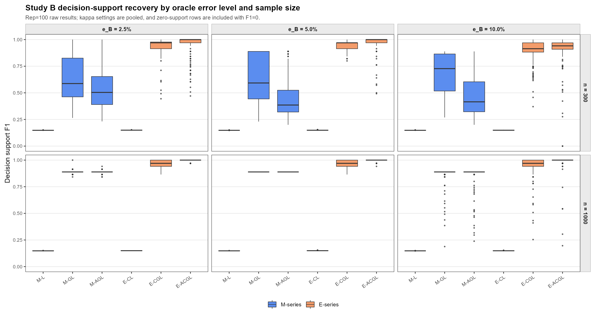
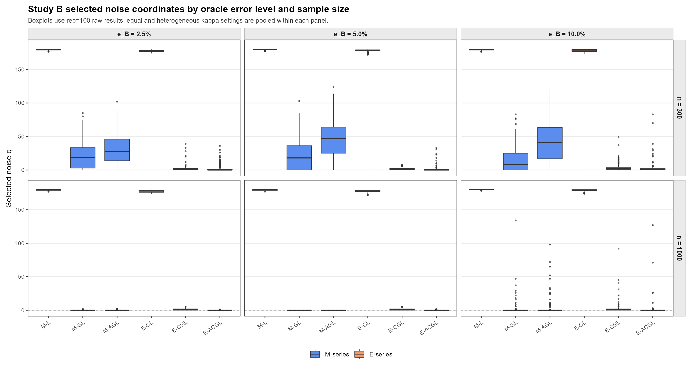
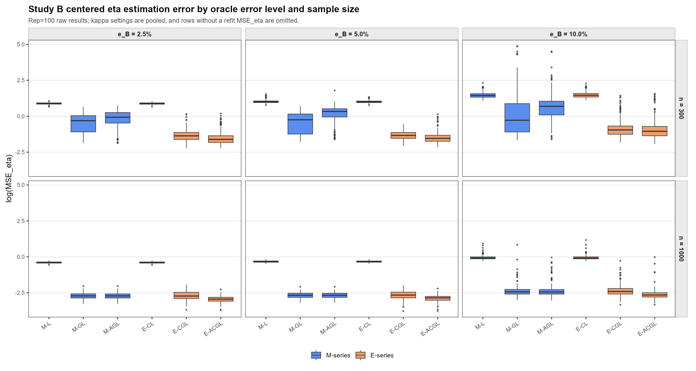

# 연구미팅 자료: Eta-group 방법론과 시뮬레이션 결과 (2026-07-14)

## 1. 핵심 정리

- 선택 대상은 prototype support가 아니라 **posterior decision support**다.
- 자연모수 $\eta_k=\kappa_k\mu_k$의 component 간 centered contrast를 사용한다.
- 주 모형은 coordinate-wise group penalty인 E-CGL이며, E-ACGL은 adaptive 보조 확장이다.
- $K$와 sparsity parameter $\lambda_\eta$는 분리해서 선택한다.

전체 수치표는 [시뮬레이션 결과 부록](../simulations/thesis-simulation_260708.md)에 정리했다.

## 2. 제안 penalty

### 2.1 $\mu$가 아니라 $\eta$

vMF mixture에서

$$
\eta_k=\kappa_k\mu_k,
\qquad
s_k(x)=\log\pi_k+\log C_d(\kappa_k)+\eta_k^\top x.
$$

따라서 두 component의 score 차이는

$$
s_k(x)-s_\ell(x)
=a_{k\ell}+(\eta_k-\eta_\ell)^\top x,
$$

$$
a_{k\ell}
=\log\frac{\pi_k}{\pi_\ell}
+\log\frac{C_d(\kappa_k)}{C_d(\kappa_\ell)}.
$$

$\eta_k\neq0$이면

$$
\kappa_k=\lVert\eta_k\rVert_2,
\qquad
\mu_k=\frac{\eta_k}{\lVert\eta_k\rVert_2}.
$$

$\eta_k=0$에서는 $\mu_k$가 식별되지 않으며, mixture label switching은 별도 문제다.

### 2.2 raw $\eta$가 아니라 centered $\eta$

좌표 $j$에 대해

$$
\eta_{\cdot j}=\bar\eta_j\mathbf 1+c_{\cdot j},
\qquad
\bar\eta_j=K^{-1}\sum_{k=1}^K\eta_{kj},
\qquad
\mathbf 1^\top c_{\cdot j}=0.
$$

$$
\eta_{kj}-\eta_{\ell j}=c_{kj}-c_{\ell j}.
$$

따라서 $x_j$가 component 간 선형 score 차이를 만드는 조건은

$$
j\in S_{\mathrm{dec}}
\iff
\lVert c_{\cdot j}\rVert_2>0.
$$

$\bar\eta_j$는 penalized fit에 남으며, $\kappa_k=\lVert\eta_k\rVert_2$를 통해 $C_d(\kappa_k)$에 영향을 줄 수 있다.

### 2.3 entry-wise $L_1$이 아니라 coordinate-wise group $L_2$

$$
P_{\mathrm{CGL}}(\eta)
=\lambda_\eta\sum_{j=1}^d\lVert c_{\cdot j}\rVert_2.
$$

Adaptive 확장은

$$
P_{\mathrm{CAGL}}(\eta)
=\lambda_\eta\sum_{j=1}^d w_j\lVert c_{\cdot j}\rVert_2,
\qquad
w_j=\left(\lVert c_{\cdot j}^{\mathrm{init}}\rVert_2+\epsilon\right)^{-\gamma}.
$$

이번 실험에서는

$$
\gamma=1,
\qquad
\epsilon=10^{-6},
$$

이며 weight에 median normalization을 적용했다. E-CGL은 $w_j=1$인 기본 모형이고, E-ACGL은 선택적 adaptive 확장이다.

### 2.4 비교 모형

| 모형 | penalty |
|:---|:---|
| M-L | $\lambda_\mu\sum_{k,j}\lvert\mu_{kj}\rvert$ |
| M-GL | $\lambda_\mu\sum_j\lVert\mu_{\cdot j}\rVert_2$ |
| M-AGL | $\lambda_\mu\sum_jw_j^{(M)}\lVert\mu_{\cdot j}\rVert_2$ |
| E-CL | $\lambda_\eta\sum_{k,j}\lvert c_{kj}\rvert$ |
| E-CGL | $\lambda_\eta\sum_j\lVert c_{\cdot j}\rVert_2$ |
| E-ACGL | $\lambda_\eta\sum_jw_j^{(E)}\lVert c_{\cdot j}\rVert_2$ |

### 2.5 구조 분해 진단

S1 환경: $K=4$, $n=1000$, $d=200$, common q=4, decision q=16, noise q=180, rep=20.

| 구조 | 모형 | selected q | common q | noise q | F1 | MSE_eta |
|:---|:---|---:|---:|---:|---:|---:|
| raw $\mu$ entry-wise | M-L | 40.65 | 4.00 | 20.65 | 0.568 | 0.232 |
| $\mu$ group | M-GL | 20.00 | 4.00 | 0.00 | 0.889 | 0.072 |
| raw $\eta$ group | E-GL | 21.15 | 4.00 | 1.15 | 0.862 | 0.089 |
| centered entry-wise | E-CL | 19.05 | 0.05 | 3.00 | 0.915 | 0.098 |
| centered group (주 모형) | E-CGL | 17.50 | 0.00 | 1.50 | 0.958 | 0.079 |
| adaptive centered group (보조) | E-ACGL | 16.05 | 0.00 | 0.05 | 0.998 | 0.057 |

여기서 `MSE_eta`는 $\mathrm{MSE}_{\mathrm{centered}\ \eta}$다.

관련 penalty 구조는 다음과 연결된다.

| 문헌 | 핵심 구조 |
|:---|:---|
| Guo et al. (2010) | $\sum_j\sum_{k<\ell}w_{k\ell j}\lvert\mu_{kj}-\mu_{\ell j}\rvert$ |
| Bondell and Reich (2009) | ANOVA level difference와 sum-to-zero constraint |
| Li et al. (2022) | common effect와 cluster-specific deviation 분해 |
| 본 연구 | $\eta_{\cdot j}=\bar\eta_j\mathbf1+c_{\cdot j}$와 coordinate group selection |

## 3. 시뮬레이션 근거

**S1-S6 시나리오 구성**

공통 설정은 $K=4$, $n=1000$, $d=200$, common q=4, decision q=16, noise q=180, rep=50, nstart=10, path length=240, BIC 선택 후 refit이다.

| 환경 | 목표 방향 차이 | 집중도 구조 | $\kappa$ | common q | decision q | noise q |
|:---|:---:|:---:|:---|---:|---:|---:|
| S1 | 큼 (90도) | 이분산 | $(30,40,50,60)$ | 4 | 16 | 180 |
| S2 | 큼 (90도) | 등분산 | $(45,45,45,45)$ | 4 | 16 | 180 |
| S3 | 보통 (60도) | 이분산 | $(30,40,50,60)$ | 4 | 16 | 180 |
| S4 | 보통 (60도) | 등분산 | $(45,45,45,45)$ | 4 | 16 | 180 |
| S5 | 작음 (30도) | 약한 이분산 | $(43,44,46,47)$ | 4 | 16 | 180 |
| S6 | 작음 (30도) | 등분산 | $(45,45,45,45)$ | 4 | 16 | 180 |

**S1-N부터 S6-N까지의 negative-control 구성**

방향 차이와 $\kappa$ 구조는 S1-S6와 같고, decision support만 80개로 늘려 sparse decision-support 가정을 약화했다.

| 환경 | 목표 방향 차이 | 집중도 구조 | $\kappa$ | common q | decision q | noise q |
|:---|:---:|:---:|:---|---:|---:|---:|
| S1-N | 큼 (90도) | 이분산 | $(30,40,50,60)$ | 4 | 80 | 116 |
| S2-N | 큼 (90도) | 등분산 | $(45,45,45,45)$ | 4 | 80 | 116 |
| S3-N | 보통 (60도) | 이분산 | $(30,40,50,60)$ | 4 | 80 | 116 |
| S4-N | 보통 (60도) | 등분산 | $(45,45,45,45)$ | 4 | 80 | 116 |
| S5-N | 작음 (30도) | 약한 이분산 | $(43,44,46,47)$ | 4 | 80 | 116 |
| S6-N | 작음 (30도) | 등분산 | $(45,45,45,45)$ | 4 | 80 | 116 |

표의 각도는 생성 목표다. 이분산에서는 정규화 과정 때문에 실제 pairwise angle에 차이가 생길 수 있으며, S3의 실제 평균은 66.02도, S5는 29.47도였다.

### 3.1 기본 및 negative-control

각 셀은 `selected q / F1`이며, 반복 수는 50회이다.

**기본 시뮬레이션: true decision q=16**

| 환경 | M-L | M-GL | M-AGL | E-CL | **E-CGL (주)** | E-ACGL (보조) |
|:---|---:|---:|---:|---:|---:|---:|
| S1 | 199.80 / 0.148 | 20.00 / 0.889 | 20.00 / 0.889 | 198.10 / 0.149 | **17.44 / 0.959** | 16.06 / 0.998 |
| S2 | 199.68 / 0.148 | 20.00 / 0.889 | 20.00 / 0.889 | 197.50 / 0.150 | **17.06 / 0.969** | 16.12 / 0.996 |
| S3 | 199.94 / 0.148 | 37.24 / 0.677 | 57.26 / 0.528 | 199.20 / 0.149 | **44.70 / 0.618** | 21.22 / 0.881 |
| S4 | 199.80 / 0.148 | 20.24 / 0.883 | 20.00 / 0.889 | 198.88 / 0.149 | **17.76 / 0.950** | 16.32 / 0.990 |
| S5 | 198.56 / 0.149 | 18.18 / 0.284 | 20.64 / 0.342 | 193.48 / 0.151 | **0.00 / NA** | 0.02 / 0.118<sup>*</sup> |
| S6 | 199.02 / 0.148 | 15.24 / 0.152 | 10.28 / 0.192 | 191.94 / 0.150 | **0.02 / 0.118**<sup>*</sup> | 0.56 / 0.105<sup>*</sup> |

**Negative-control: true decision q=80**

| 환경 | M-L | M-GL | M-AGL | E-CL | **E-CGL (주)** | E-ACGL (보조) |
|:---|---:|---:|---:|---:|---:|---:|
| S1-N | 199.04 / 0.573 | 86.66 / 0.960 | 85.48 / 0.966 | 195.86 / 0.580 | **88.34 / 0.951** | 82.40 / 0.985 |
| S2-N | 197.22 / 0.577 | 85.66 / 0.966 | 84.58 / 0.972 | 192.18 / 0.588 | **87.36 / 0.956** | 81.82 / 0.989 |
| S3-N | 199.78 / 0.572 | 98.40 / 0.869 | 85.84 / 0.877 | 198.36 / 0.575 | **97.02 / 0.788** | 76.06 / 0.840 |
| S4-N | 199.30 / 0.573 | 4.02 / 0.000 | 4.02 / 0.000 | 196.04 / 0.580 | **0.00 / 0.000** | 16.70 / 0.331 |
| S5-N | 198.52 / 0.571 | 16.56 / 0.170 | 16.80 / 0.201 | 188.22 / 0.565 | **0.00 / NA** | 0.06 / 0.025<sup>*</sup> |
| S6-N | 197.56 / 0.570 | 15.82 / 0.135 | 10.96 / 0.108 | 187.38 / 0.564 | **0.00 / NA** | 2.04 / 0.172<sup>*</sup> |

`*`는 nonzero refit 반복만의 조건부 F1이다. S5/S6과 S5-N/S6-N에서는 E 계열이 대부분 zero support를 선택했다. S4-N의 E-ACGL은 10/50회에서 nonzero support를 선택했으며, 표의 F1=0.331은 전체 반복 기준이다.

### 3.2 Shared-background

설정은 common q=80, decision q=20, noise q=100, rep=50이다.

| 모형 | selected q | common q | decision q | noise q | F1 | ARI | MSE_eta |
|:---|---:|---:|---:|---:|---:|---:|---:|
| M-L | 199.02 | 80.00 | 20.00 | 99.02 | 0.183 | 0.591 | 0.993 |
| M-GL | 102.92 | 80.00 | 20.00 | 2.92 | 0.325 | 0.638 | 0.495 |
| M-AGL | 102.40 | 79.96 | 20.00 | 2.44 | 0.327 | 0.638 | 0.492 |
| E-CL | 199.00 | 79.54 | 20.00 | 99.46 | 0.183 | 0.594 | 0.987 |
| **E-CGL (주)** | **22.04** | **0.88** | **20.00** | **1.16** | **0.953** | **0.674** | **0.122** |
| E-ACGL (보조) | 20.48 | 0.30 | 20.00 | 0.18 | 0.988 | 0.676 | 0.096 |

M-L과 E-CL은 거의 모든 좌표를 유지한다. M-GL/M-AGL은 common q를 유지하고, E-CGL/E-ACGL은 decision q를 중심으로 선택한다.

### 3.3 Oracle Bayes error 기반 Study B

$K = 4, \quad d = 200, \quad n \in \{300, 1000\}, \quad q_C = 4, \quad q_D = 16, \quad q_N = 180, \quad R = 100.$

```math
e_B \in \{2.5\%, 5\%, 10\%\}, \qquad
\kappa \in \{(45,45,45,45), (30,40,50,60)\}.
```


결과 파일의 D-L, D-GL, D-AGL은 각각 M-L, M-GL, M-AGL로, E-L, E-GL, E-AGL은 각각 E-CL, E-CGL, E-ACGL로 표기했다. E-CGL이 주 모형이고 E-ACGL은 adaptive 보조 결과다. 각 값은 equal/heterogeneous $\kappa$ 조건의 시나리오별 평균을 동일 가중 평균한 결과다.

#### target $e_B=2.5\%$

| $n$ | 모형 | selected q | common q | decision q | noise q | F1 | ARI | MSE_eta |
|---:|:---|---:|---:|---:|---:|---:|---:|---:|
| 300 | M-L | 199.58 | 4.00 | 16.00 | 179.58 | 0.148 | 0.887 | 2.426 |
| 300 | M-GL | 41.17 | 3.70 | 16.00 | 21.47 | 0.563 | 0.924 | 0.736 |
| 300 | M-AGL | 50.83 | 3.83 | 16.00 | 31.01 | 0.480 | 0.915 | 0.945 |
| 300 | E-CL | 197.99 | 3.95 | 16.00 | 178.04 | 0.150 | 0.889 | 2.419 |
| 300 | **E-CGL (주)** | 18.38 | 0.08 | 16.00 | 2.31 | 0.931 | 0.931 | 0.282 |
| 300 | E-ACGL (보조) | 18.10 | 0.03 | 16.00 | 2.08 | 0.938 | 0.930 | 0.256 |
| 1000 | M-L | 199.48 | 4.00 | 16.00 | 179.48 | 0.149 | 0.923 | 0.674 |
| 1000 | M-GL | 20.05 | 3.96 | 16.00 | 0.09 | 0.888 | 0.937 | 0.067 |
| 1000 | M-AGL | 20.04 | 3.97 | 16.00 | 0.08 | 0.888 | 0.937 | 0.067 |
| 1000 | E-CL | 197.47 | 3.94 | 16.00 | 177.53 | 0.150 | 0.923 | 0.673 |
| 1000 | **E-CGL (주)** | 17.08 | 0.02 | 16.00 | 1.06 | 0.967 | 0.936 | 0.069 |
| 1000 | E-ACGL (보조) | 16.04 | 0.00 | 16.00 | 0.04 | 0.999 | 0.937 | 0.053 |

#### target $e_B=5.0\%$

| $n$ | 모형 | selected q | common q | decision q | noise q | F1 | ARI | MSE_eta |
|---:|:---|---:|---:|---:|---:|---:|---:|---:|
| 300 | M-L | 199.70 | 4.00 | 16.00 | 179.70 | 0.148 | 0.774 | 2.784 |
| 300 | M-GL | 41.77 | 4.00 | 16.00 | 21.77 | 0.554 | 0.857 | 0.787 |
| 300 | M-AGL | 66.04 | 4.00 | 16.00 | 46.04 | 0.392 | 0.827 | 1.342 |
| 300 | E-CL | 198.20 | 3.93 | 16.00 | 178.27 | 0.149 | 0.778 | 2.756 |
| 300 | **E-CGL (주)** | 17.66 | 0.07 | 16.00 | 1.59 | 0.951 | 0.869 | 0.276 |
| 300 | E-ACGL (보조) | 17.34 | 0.04 | 16.00 | 1.31 | 0.960 | 0.870 | 0.247 |
| 1000 | M-L | 199.62 | 4.00 | 16.00 | 179.62 | 0.148 | 0.851 | 0.722 |
| 1000 | M-GL | 20.00 | 4.00 | 16.00 | 0.00 | 0.889 | 0.879 | 0.070 |
| 1000 | M-AGL | 20.00 | 4.00 | 16.00 | 0.00 | 0.889 | 0.879 | 0.070 |
| 1000 | E-CL | 197.60 | 3.95 | 16.00 | 177.65 | 0.150 | 0.851 | 0.721 |
| 1000 | **E-CGL (주)** | 17.12 | 0.03 | 16.00 | 1.09 | 0.966 | 0.880 | 0.073 |
| 1000 | E-ACGL (보조) | 16.08 | 0.00 | 16.00 | 0.08 | 0.998 | 0.880 | 0.057 |

#### target $e_B=10.0\%$

| $n$ | 모형 | selected q | common q | decision q | noise q | F1 | ARI | MSE_eta |
|---:|:---|---:|---:|---:|---:|---:|---:|---:|
| 300 | M-L | 199.60 | 4.00 | 16.00 | 179.60 | 0.148 | 0.478 | 4.418 |
| 300 | M-GL | 34.55 | 4.00 | 15.87 | 14.68 | 0.630 | 0.654 | 5.938 |
| 300 | M-AGL | 61.59 | 4.00 | 15.95 | 41.64 | 0.416 | 0.611 | 3.459 |
| 300 | E-CL | 198.25 | 3.96 | 16.00 | 178.29 | 0.149 | 0.472 | 4.539 |
| 300 | **E-CGL (주)** | 19.64 | 0.10 | 15.79 | 3.76 | 0.890 | 0.698 | 0.547 |
| 300 | E-ACGL (보조) | 18.21 | 0.06 | 15.24 | 2.92 | 0.893 | 0.693 | 0.568 |
| 1000 | M-L | 199.85 | 4.00 | 16.00 | 179.85 | 0.148 | 0.658 | 0.963 |
| 1000 | M-GL | 21.96 | 4.00 | 16.00 | 1.96 | 0.845 | 0.729 | 0.110 |
| 1000 | M-AGL | 22.78 | 4.00 | 16.00 | 2.78 | 0.829 | 0.728 | 0.110 |
| 1000 | E-CL | 198.79 | 3.98 | 16.00 | 178.81 | 0.149 | 0.658 | 0.965 |
| 1000 | **E-CGL (주)** | 18.89 | 0.06 | 16.00 | 2.83 | 0.919 | 0.730 | 0.104 |
| 1000 | E-ACGL (보조) | 17.57 | 0.05 | 16.00 | 1.52 | 0.955 | 0.731 | 0.082 |

Zero-support 반복은 F1=0으로 포함했다. 반복별 분포와 $\kappa$ 조건에 따른 차이는 하단 boxplot에 제시했다.







### 3.4 Rossi-type M-L 대비 불리한 조건

M-L은 Rossi와 Barbaro (2022)의 sparse $\mu$ prototype 모형을 재현한 기준이다. M-L과 E-CGL은 support 목표가 다르므로 decision F1만으로 절대적 우열을 판단하지 않고, ARI, MSE_eta와 zero-support 안정성을 함께 비교했다.

| 환경 | M-L | E-CGL (주) | 확인 결과 |
|:---|:---|:---|:---|
| S3-N | ARI=0.547, MSE_eta=2.280 | ARI=0.558, MSE_eta=2.309 | ARI와 decision F1은 E-CGL이 높지만 MSE_eta는 소폭 큼 |
| S4-N | ARI=0.563, F1=0.573, selected q=199.30 | zero support=50/50, F1=0.000 | E-CGL의 BIC tuning이 명확히 불리함 |
| S5 | ARI=0.031, selected q=198.56 | zero support=50/50 | M-L은 dense fit을 반환하지만 두 모형 모두 군집 분리가 거의 되지 않음 |
| S6 | ARI=0.010, selected q=199.02 | nonzero support=1/50 | E-CGL의 support 선택이 불안정함 |
| S5-N/S6-N | ARI=0.023/0.012, F1=0.571/0.570 | zero support=50/50, 50/50 | 약한 신호에서 E-CGL의 support 선택이 불안정함 |

별도 Rossi-style prototype-sparse pilot(rep=5)에서도 불리한 조건이 확인되었다. Prototype zero 비율은 5%, 10%, 15%이며, 아래 valid 값은 이 순서의 세 cell을 요약한다.

| 설정 | M-L | E-ACGL | 해석 |
|:---|:---|:---|:---|
| $n=200$, overlap 2.5% | valid=5/5, ARI=0.889-0.936 | valid=3-4/5, ARI=0.867-0.930 | Eta 계열이 prototype support를 과소선택 |
| $n=200$, overlap 5% | valid=5/5, ARI=0.794-0.849 | valid=0/5, 0/5, 1/5 | 작은 표본과 높은 overlap에서 Eta 계열의 zero-support 선택 집중 |
| $n=1000$, overlap 2.5-5% | 모든 cell valid=5/5 | 모든 cell valid=5/5 | ARI는 유사하지만 prototype-support 지표는 대체로 M-L이 높음 |

이 pilot은 E-ACGL만 포함했으므로 E-CGL과 M-L의 직접 비교로 해석하지 않는다. 현재 결과에서 E-CGL의 분명한 약점은 약한 신호 또는 dense support와 보통 이하의 분리가 결합될 때 BIC가 zero support를 선택할 수 있다는 점이다.

## 4. $K$와 $\lambda_\eta$ 선택

동시 선택 진단은 $K^\ast=4$, $n=1000$, $d=200$, $e_B=5\%$, rep=5에서 수행했다.

Dense vMF는 sparsity penalty를 두지 않고($\lambda=0$) 모든 $d$개 coordinate를 사용하며, component별 $\mu_k$와 $\kappa_k$를 추정하는 vMF mixture다. 변수 선택은 수행하지 않는다.

| 방법 | equal $\kappa$ | heterogeneous $\kappa$ |
|:---|:---|:---|
| Dense vMF | BIC: $K=4$; EBIC: $K=2$ | BIC: $K=3$; EBIC: $K=2$ |
| M-GL/M-AGL | 대부분 또는 전부 $K=4$ | 전부 $K=4$ |
| E-CGL all-in-one (주) | BIC: $K=6$-$8$; EBIC: $K=4,6,8$ | BIC: $K=6,8$; EBIC: $K=4,6,8$ |
| E-ACGL all-in-one (보조) | BIC: $K=6,8$; EBIC: $K=7,8$ | BIC: $K=5,8$; EBIC: $K=7,8$ |

현재 선택 절차는

$$
\widehat K
=\arg\min_{K\in\mathcal K}\mathrm{IC}_{\mathrm{dense/group}}(K),
$$

$$
\widehat\lambda_\eta
=\arg\min_{\lambda_\eta}
\mathrm{BIC}(\widehat K,\lambda_\eta)
$$

의 2단계로 분리한다. Rossi and Barbaro (2022)의 dense-$K$ 선택 후 sparsity path 선택 구조와 같은 방향이다.

현재 centered eta BIC는

$$
\mathrm{BIC}(\lambda_\eta)
=-2\ell(\widehat\Theta_{\lambda_\eta})
+\log(n)\left[(K-1)+d+(K-1)m_{\lambda_\eta}\right]
$$

이며 penalized path에서 BIC를 선택한 뒤 support refit을 수행한다.

## 5. 비용과 한계

| 항목 | 확인 결과 |
|:---|:---|
| 계산 시간 | E-CGL 5.62초; E-ACGL 5.53초(보조); M-L 3.75초; M-GL/M-AGL 8.82/8.53초 |
| 약한 신호 | S5/S6에서 E-CGL과 E-ACGL 모두 대부분 zero support |
| dense support | S3-N/S4-N에서 과소선택 또는 tuning failure |
| $K$ 동시 선택 | E-CGL/E-ACGL all-in-one에서 큰 $K$를 선호 |
| refit 정의 | penalty 단계는 common $\eta$ baseline을 유지하지만 현재 refit은 selected coordinate만 유지 |
| BIC df | refit target과 df의 일관성 추가 점검 필요 |

## 6. 현재 결론

$$
\text{posterior decision support} \Rightarrow \eta = \kappa\mu \Rightarrow c_{kj} = \eta_{kj} - \bar{\eta}_{j} \Rightarrow \lambda_\eta\sum_{j}\|c_{\cdot j}\|_2
$$

* E-CGL은 sparse posterior decision support 복원을 위한 주 모형이다.
* E-ACGL은 $\lambda_\eta\sum_j w_j^{(E)}\|c_{\cdot j}\|_2$를 사용하는 adaptive 보조 확장이다.
* 약한 신호, 일부 dense-support 환경, $K$와 $\lambda_\eta$의 동시 선택에서는 성능 저하가 관찰됐다.
* 다음 검증 항목은 refit/df 정합성과 동일한 $\mu$에서 $\kappa$만 다른 concentration-only 환경이다.
