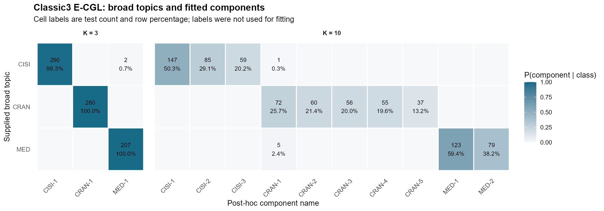

# 연구미팅 자료: E-CGL 방법론과 실증 결과 (2026-07-14)

## 1. 핵심 정리

- 선택 대상은 prototype support가 아니라 **posterior decision support**다.
- 자연모수 $\eta_k=\kappa_k\mu_k$의 component 간 centered contrast를 사용한다.
- 주 모형은 coordinate-wise group penalty인 E-CGL이며, E-ACGL은 adaptive 보조 확장이다.
- 선택 후에는 $c_{\cdot j}=0$을 고정하고 공통 $\bar\eta_j$를 재추정하는 exact centered- $\eta$ refit(B)을 사용한다.
- $K$와 sparsity parameter $\lambda_\eta$는 분리해서 선택한다.

전체 수치표는 [시뮬레이션 결과 부록](../simulations/thesis-simulation_260708.md)에 정리했다.

## 2. 제안 penalty

### 2.1 $\mu$가 아니라 $\eta$

vMF mixture에서

$$
\eta_k=\kappa_k\mu_k,
\qquad
s_k(x)=\log\pi_k+\log C_d(\kappa_k)+\eta_k^\top x.
$$

따라서 두 component의 score 차이는

$$
s_k(x)-s_\ell(x)
=a_{k\ell}+(\eta_k-\eta_\ell)^\top x,
$$

$$
a_{k\ell}
=\log\frac{\pi_k}{\pi_\ell}
+\log\frac{C_d(\kappa_k)}{C_d(\kappa_\ell)}.
$$

$\eta_k\neq0$이면

$$
\kappa_k=\lVert\eta_k\rVert_2,
\qquad
\mu_k=\frac{\eta_k}{\lVert\eta_k\rVert_2}.
$$

$\eta_k=0$에서는 $\mu_k$가 식별되지 않으며, mixture label switching은 별도 문제다.

### 2.2 raw $\eta$가 아니라 centered $\eta$

좌표 $j$에 대해

$$
\eta_{\cdot j}=\bar\eta_j\mathbf 1+c_{\cdot j},
\qquad
\bar\eta_j=K^{-1}\sum_{k=1}^K\eta_{kj},
\qquad
\mathbf 1^\top c_{\cdot j}=0.
$$

$$
\eta_{kj}-\eta_{\ell j}=c_{kj}-c_{\ell j}.
$$

따라서 $x_j$가 component 간 선형 score 차이를 만드는 조건은

$$
j\in S_{\mathrm{dec}}
\iff
\lVert c_{\cdot j}\rVert_2>0.
$$

$\bar\eta_j$는 penalized fit에 남으며, $\kappa_k=\lVert\eta_k\rVert_2$를 통해 $C_d(\kappa_k)$에 영향을 줄 수 있다.

### 2.3 entry-wise $L_1$이 아니라 coordinate-wise group $L_2$

$$
P_{\mathrm{CGL}}(\eta)
=\lambda_\eta\sum_{j=1}^d\lVert c_{\cdot j}\rVert_2.
$$

Adaptive 확장은

$$
P_{\mathrm{CAGL}}(\eta)
=\lambda_\eta\sum_{j=1}^d w_j\lVert c_{\cdot j}\rVert_2,
\qquad
w_j=\left(\lVert c_{\cdot j}^{\mathrm{init}}\rVert_2+\epsilon\right)^{-\gamma}.
$$

시뮬레이션에서는

$$
\gamma=1,
\qquad
\epsilon=10^{-6},
$$

이며 weight에 median normalization을 적용했다. E-CGL은 $w_j=1$인 기본 모형이고, E-ACGL은 선택적 adaptive 확장이다.

### 2.4 선택 후 refit 제약

선택 support를

$$
\widehat S_{\mathrm{dec}}
=\{j:\lVert\widehat c_{\cdot j}\rVert_2>0\}
$$

로 두면, 비선택 좌표에 대한 centered-$\eta$ 제약은

$$
j\notin\widehat S_{\mathrm{dec}}
\quad\Longrightarrow\quad
c_{\cdot j}=0
\quad\Longleftrightarrow\quad
\eta_{1j}=\cdots=\eta_{Kj}=\bar\eta_j
$$

이다. 기존 active-only refit(A)과 exact centered-$\eta$ refit(B)은 다음과 같다.

| refit | 비선택 좌표 제약 | 공통 baseline $\bar\eta_j$ | 역할 |
|:---|:---|:---|:---|
| A: active-only | $\eta_{1j}=\cdots=\eta_{Kj}=0$ | 제거 | 기존 결과와의 진단 비교 |
| B: centered fixed-support | $c_{\cdot j}=0$ | 전체 좌표에서 재추정 | 주 분석 |

B refit의 실용적 자유도는

$$
\mathrm{df}_B(m) = d + (K-1)m + (K-1)\mathbf{1}(m > 0), \qquad m = |\widehat{S}_{\mathrm{dec}}|,
$$

이며, 각 path support를 B로 refit한 observed log-likelihood에 BIC를 적용한다.

### 2.5 비교 모형

| 모형 | penalty |
|:---|:---|
| M-L | $\lambda_\mu\sum_{k,j}\lvert\mu_{kj}\rvert$ |
| M-GL | $\lambda_\mu\sum_j\lVert\mu_{\cdot j}\rVert_2$ |
| M-AGL | $\lambda_\mu\sum_jw_j^{(M)}\lVert\mu_{\cdot j}\rVert_2$ |
| E-CL | $\lambda_\eta\sum_{k,j}\lvert c_{kj}\rvert$ |
| E-CGL | $\lambda_\eta\sum_j\lVert c_{\cdot j}\rVert_2$ |
| E-ACGL | $\lambda_\eta\sum_jw_j^{(E)}\lVert c_{\cdot j}\rVert_2$ |

M-L은 Rossi and Barbaro (2022)의 sparse vMF prototype 방법을 재현한 비교 모형이며, 방향모수 $\mu$에 entry-wise $L_1$ penalty를 적용한다. M-L의 support는 prototype coordinate를, E-CGL의 support는 posterior decision coordinate를 나타낸다.

### 2.6 구조 분해 및 refit 진단

S1 환경: $K=4$, $n=1000$, $d=200$, common q=4, decision q=16, noise q=180, rep=20.

| 구조 | 모형 | selected q | common q | noise q | F1 | MSE_eta |
|:---|:---|---:|---:|---:|---:|---:|
| raw $\mu$ entry-wise | M-L | 40.65 | 4.00 | 20.65 | 0.568 | 0.232 |
| $\mu$ group | M-GL | 20.00 | 4.00 | 0.00 | 0.889 | 0.072 |
| raw $\eta$ group | E-GL | 21.15 | 4.00 | 1.15 | 0.862 | 0.089 |
| centered entry-wise | E-CL | 19.05 | 0.05 | 3.00 | 0.915 | 0.098 |
| centered group (주 모형) | E-CGL | 17.50 | 0.00 | 1.50 | 0.958 | 0.079 |
| adaptive centered group (보조) | E-ACGL | 16.05 | 0.00 | 0.05 | 0.998 | 0.057 |

여기서 `MSE_eta`는 $\mathrm{MSE}_{\mathrm{centered}\ \eta}$다.

동일한 Study B 표본과 support에서 A와 B를 비교한 진단은 다음과 같다. 설정은 $K=4$, $n=300$, $d=200$, 목표 oracle Bayes error $5\%$, $\kappa=(30,40,50,60)$, path length 240, rep=5이다.

| 모형 | selector/refit | selected q | common q | decision q | noise q | F1 | ARI | MSE_eta | MSE_kappa | log-likelihood |
|:---|:---|---:|---:|---:|---:|---:|---:|---:|---:|---:|
| E-CGL | BIC-before + A | 18.0 | 0.2 | 16.0 | 1.8 | 0.943 | 0.853 | 0.288 | 32.03 | 74,045.75 |
| E-CGL | 같은 support + B | 18.0 | 0.2 | 16.0 | 1.8 | 0.943 | 0.849 | 0.291 | 9.40 | 74,437.76 |
| E-CGL | BIC-after + B | 16.2 | 0.0 | 16.0 | 0.2 | 0.994 | 0.854 | 0.200 | 7.11 | 74,426.43 |
| E-ACGL | BIC-before + A | 16.2 | 0.0 | 16.0 | 0.2 | 0.994 | 0.856 | 0.199 | 37.95 | 74,015.94 |
| E-ACGL | 같은 support + B | 16.2 | 0.0 | 16.0 | 0.2 | 0.994 | 0.856 | 0.200 | 7.14 | 74,426.43 |
| E-ACGL | BIC-after + B | 16.2 | 0.0 | 16.0 | 0.2 | 0.994 | 0.856 | 0.200 | 7.14 | 74,426.43 |

고정 support에서는 A와 B의 support 지표가 동일했다. B는 공통 baseline을 유지하면서 $\kappa$ 오차를 줄였고, BIC-after에서는 E-CGL의 noise 선택이 감소했다. 1,620개 candidate exact refit에서 실패는 없었으며 최대 centered-support 제약 오차는 $1.78\times10^{-15}$였다. 이 표는 refit 정의를 확인하기 위한 진단 결과다.

관련 penalty 구조는 다음과 연결된다.

| 문헌 | 핵심 구조 |
|:---|:---|
| Guo et al. (2010) | $\sum_j\sum_{k<\ell}w_{k\ell j}\lvert\mu_{kj}-\mu_{\ell j}\rvert$ |
| Bondell and Reich (2009) | ANOVA level difference와 sum-to-zero constraint |
| Li et al. (2022) | common effect와 cluster-specific deviation 분해 |
| 본 연구 | $\eta_{\cdot j}=\bar\eta_j\mathbf1+c_{\cdot j}$와 coordinate group selection |

## 3. 시뮬레이션 근거

**S1-S6 시나리오 구성**

공통 설정은 $K=4$, $n=1000$, $d=200$, common q=4, decision q=16, noise q=180, rep=50, nstart=10, path length=240, BIC 선택 후 refit이다.

| 환경 | 목표 방향 차이 | 집중도 구조 | $\kappa$ | common q | decision q | noise q |
|:---|:---:|:---:|:---|---:|---:|---:|
| S1 | 큼 (90도) | 이분산 | $(30,40,50,60)$ | 4 | 16 | 180 |
| S2 | 큼 (90도) | 등분산 | $(45,45,45,45)$ | 4 | 16 | 180 |
| S3 | 보통 (60도) | 이분산 | $(30,40,50,60)$ | 4 | 16 | 180 |
| S4 | 보통 (60도) | 등분산 | $(45,45,45,45)$ | 4 | 16 | 180 |
| S5 | 작음 (30도) | 약한 이분산 | $(43,44,46,47)$ | 4 | 16 | 180 |
| S6 | 작음 (30도) | 등분산 | $(45,45,45,45)$ | 4 | 16 | 180 |

**S1-N부터 S6-N까지의 negative-control 구성**

방향 차이와 $\kappa$ 구조는 S1-S6와 같고, decision support만 80개로 늘려 sparse decision-support 가정을 약화했다.

| 환경 | 목표 방향 차이 | 집중도 구조 | $\kappa$ | common q | decision q | noise q |
|:---|:---:|:---:|:---|---:|---:|---:|
| S1-N | 큼 (90도) | 이분산 | $(30,40,50,60)$ | 4 | 80 | 116 |
| S2-N | 큼 (90도) | 등분산 | $(45,45,45,45)$ | 4 | 80 | 116 |
| S3-N | 보통 (60도) | 이분산 | $(30,40,50,60)$ | 4 | 80 | 116 |
| S4-N | 보통 (60도) | 등분산 | $(45,45,45,45)$ | 4 | 80 | 116 |
| S5-N | 작음 (30도) | 약한 이분산 | $(43,44,46,47)$ | 4 | 80 | 116 |
| S6-N | 작음 (30도) | 등분산 | $(45,45,45,45)$ | 4 | 80 | 116 |

표의 각도는 생성 목표다. 이분산에서는 정규화 과정 때문에 실제 pairwise angle에 차이가 생길 수 있으며, S3의 실제 평균은 66.02도, S5는 29.47도였다.

### 3.1 기본 및 negative-control

각 셀은 `selected q / F1`이며, 반복 수는 50회이다.

**기본 시뮬레이션: true decision q=16**

| 환경 | M-L | M-GL | M-AGL | E-CL | **E-CGL (주)** | E-ACGL (보조) |
|:---|---:|---:|---:|---:|---:|---:|
| S1 | 199.80 / 0.148 | 20.00 / 0.889 | 20.00 / 0.889 | 198.10 / 0.149 | **17.44 / 0.959** | 16.06 / 0.998 |
| S2 | 199.68 / 0.148 | 20.00 / 0.889 | 20.00 / 0.889 | 197.50 / 0.150 | **17.06 / 0.969** | 16.12 / 0.996 |
| S3 | 199.94 / 0.148 | 37.24 / 0.677 | 57.26 / 0.528 | 199.20 / 0.149 | **44.70 / 0.618** | 21.22 / 0.881 |
| S4 | 199.80 / 0.148 | 20.24 / 0.883 | 20.00 / 0.889 | 198.88 / 0.149 | **17.76 / 0.950** | 16.32 / 0.990 |
| S5 | 198.56 / 0.149 | 18.18 / 0.284 | 20.64 / 0.342 | 193.48 / 0.151 | **0.00 / NA** | 0.02 / 0.118<sup>*</sup> |
| S6 | 199.02 / 0.148 | 15.24 / 0.152 | 10.28 / 0.192 | 191.94 / 0.150 | **0.02 / 0.118**<sup>*</sup> | 0.56 / 0.105<sup>*</sup> |

**Negative-control: true decision q=80**

| 환경 | M-L | M-GL | M-AGL | E-CL | **E-CGL (주)** | E-ACGL (보조) |
|:---|---:|---:|---:|---:|---:|---:|
| S1-N | 199.04 / 0.573 | 86.66 / 0.960 | 85.48 / 0.966 | 195.86 / 0.580 | **88.34 / 0.951** | 82.40 / 0.985 |
| S2-N | 197.22 / 0.577 | 85.66 / 0.966 | 84.58 / 0.972 | 192.18 / 0.588 | **87.36 / 0.956** | 81.82 / 0.989 |
| S3-N | 199.78 / 0.572 | 98.40 / 0.869 | 85.84 / 0.877 | 198.36 / 0.575 | **97.02 / 0.788** | 76.06 / 0.840 |
| S4-N | 199.30 / 0.573 | 4.02 / 0.000 | 4.02 / 0.000 | 196.04 / 0.580 | **0.00 / 0.000** | 16.70 / 0.331 |
| S5-N | 198.52 / 0.571 | 16.56 / 0.170 | 16.80 / 0.201 | 188.22 / 0.565 | **0.00 / NA** | 0.06 / 0.025<sup>*</sup> |
| S6-N | 197.56 / 0.570 | 15.82 / 0.135 | 10.96 / 0.108 | 187.38 / 0.564 | **0.00 / NA** | 2.04 / 0.172<sup>*</sup> |

`*`는 nonzero refit 반복만의 조건부 F1이다. S5/S6과 S5-N/S6-N에서는 E 계열이 대부분 zero support를 선택했다. S4-N의 E-ACGL은 10/50회에서 nonzero support를 선택했으며, 표의 F1=0.331은 전체 반복 기준이다.

### 3.2 Shared-background

설정은 common q=80, decision q=20, noise q=100, rep=50이다.

| 모형 | selected q | common q | decision q | noise q | F1 | ARI | MSE_eta |
|:---|---:|---:|---:|---:|---:|---:|---:|
| M-L | 199.02 | 80.00 | 20.00 | 99.02 | 0.183 | 0.591 | 0.993 |
| M-GL | 102.92 | 80.00 | 20.00 | 2.92 | 0.325 | 0.638 | 0.495 |
| M-AGL | 102.40 | 79.96 | 20.00 | 2.44 | 0.327 | 0.638 | 0.492 |
| E-CL | 199.00 | 79.54 | 20.00 | 99.46 | 0.183 | 0.594 | 0.987 |
| **E-CGL (주)** | **22.04** | **0.88** | **20.00** | **1.16** | **0.953** | **0.674** | **0.122** |
| E-ACGL (보조) | 20.48 | 0.30 | 20.00 | 0.18 | 0.988 | 0.676 | 0.096 |

M-L과 E-CL은 거의 모든 좌표를 유지한다. M-GL/M-AGL은 common q를 유지하고, E-CGL/E-ACGL은 decision q를 중심으로 선택한다.

### 3.3 Oracle Bayes error 기반 Study B

$K = 4, \quad d = 200, \quad n \in \{300, 1000\}, \quad q_C = 4, \quad q_D = 16, \quad q_N = 180, \quad R = 100.$

```math
e_B \in \{2.5\%, 5\%, 10\%\}, \qquad
\kappa \in \{(45,45,45,45), (30,40,50,60)\}.
```

E-CGL과 E-ACGL은 penalized path의 BIC 상위 40개 support를 exact centered-support refit한 뒤 BIC를 다시 계산하였다. 경계 후보가 선택되면 전체 support로 확장하는 guard를 두었으며, 최종 1,200개 E 계열 적합에서 full fallback은 발생하지 않았다. 아래 값은 등분산·이분산 $\kappa$ 결과의 동일 가중 평균이다.

| target $e_B$ | achieved $e_B$: equal | achieved $e_B$: heterogeneous |
|---:|---:|---:|
| 2.5% | 2.33% | 2.73% |
| 5.0% | 5.14% | 5.00% |
| 10.0% | 10.09% | 9.84% |

#### target $e_B=2.5\%$

| $n$ | 모형 | selected q | common q | decision q | noise q | F1 | ARI | MSE_eta |
|---:|:---|---:|---:|---:|---:|---:|---:|---:|
| 300 | M-L | 199.59 | 4.00 | 16.00 | 179.59 | 0.148 | 0.880 | 2.462 |
| 300 | M-GL | 42.16 | 3.98 | 16.00 | 22.18 | 0.617 | 0.918 | 0.756 |
| 300 | M-AGL | 52.74 | 4.00 | 16.00 | 32.74 | 0.524 | 0.910 | 0.981 |
| 300 | E-CL | 197.83 | 3.94 | 16.00 | 177.89 | 0.150 | 0.877 | 2.470 |
| 300 | **E-CGL (주)** | **16.51** | **0.01** | **16.00** | **0.50** | **0.987** | **0.931** | **0.204** |
| 300 | E-ACGL (보조) | 17.99 | 0.03 | 16.00 | 1.96 | 0.960 | 0.930 | 0.250 |
| 1000 | M-L | 199.56 | 4.00 | 16.00 | 179.56 | 0.148 | 0.917 | 0.678 |
| 1000 | M-GL | 20.02 | 4.00 | 16.00 | 0.02 | 0.889 | 0.933 | 0.066 |
| 1000 | M-AGL | 20.01 | 4.00 | 16.00 | 0.01 | 0.889 | 0.934 | 0.065 |
| 1000 | E-CL | 197.57 | 3.92 | 16.00 | 177.65 | 0.150 | 0.917 | 0.678 |
| 1000 | **E-CGL (주)** | **16.05** | **0.00** | **16.00** | **0.05** | **0.999** | **0.934** | **0.053** |
| 1000 | E-ACGL (보조) | 16.03 | 0.00 | 16.00 | 0.03 | 0.999 | 0.934 | 0.053 |

#### target $e_B=5.0\%$

| $n$ | 모형 | selected q | common q | decision q | noise q | F1 | ARI | MSE_eta |
|---:|:---|---:|---:|---:|---:|---:|---:|---:|
| 300 | M-L | 199.69 | 4.00 | 16.00 | 179.69 | 0.148 | 0.750 | 2.868 |
| 300 | M-GL | 43.42 | 4.00 | 16.00 | 23.42 | 0.620 | 0.833 | 0.823 |
| 300 | M-AGL | 65.32 | 4.00 | 16.00 | 45.32 | 0.457 | 0.811 | 1.306 |
| 300 | E-CL | 197.86 | 3.95 | 16.00 | 177.91 | 0.150 | 0.751 | 2.861 |
| 300 | **E-CGL (주)** | **16.24** | **0.00** | **16.00** | **0.24** | **0.993** | **0.856** | **0.210** |
| 300 | E-ACGL (보조) | 16.80 | 0.01 | 16.00 | 0.79 | 0.981 | 0.856 | 0.231 |
| 1000 | M-L | 199.66 | 4.00 | 16.00 | 179.66 | 0.148 | 0.838 | 0.732 |
| 1000 | M-GL | 20.01 | 4.00 | 16.00 | 0.01 | 0.889 | 0.869 | 0.069 |
| 1000 | M-AGL | 20.00 | 4.00 | 16.00 | 0.00 | 0.889 | 0.869 | 0.069 |
| 1000 | E-CL | 197.85 | 3.95 | 16.00 | 177.90 | 0.150 | 0.837 | 0.733 |
| 1000 | **E-CGL (주)** | **16.08** | **0.00** | **16.00** | **0.08** | **0.998** | **0.869** | **0.057** |
| 1000 | E-ACGL (보조) | 16.08 | 0.00 | 16.00 | 0.08 | 0.998 | 0.869 | 0.057 |

#### target $e_B=10.0\%$

| $n$ | 모형 | selected q | common q | decision q | noise q | F1 | ARI | MSE_eta |
|---:|:---|---:|---:|---:|---:|---:|---:|---:|
| 300 | M-L | 199.70 | 4.00 | 16.00 | 179.70 | 0.148 | 0.496 | 4.229 |
| 300 | M-GL | 34.93 | 4.00 | 15.97 | 14.96 | 0.691 | 0.667 | 5.858 |
| 300 | M-AGL | 64.04 | 4.00 | 15.98 | 44.06 | 0.454 | 0.621 | 2.657 |
| 300 | E-CL | 197.68 | 3.94 | 16.00 | 177.74 | 0.150 | 0.500 | 4.198 |
| 300 | **E-CGL (주)** | **17.38** | **0.03** | **15.61** | **1.75** | **0.946** | **0.705** | **0.523** |
| 300 | E-ACGL (보조) | 17.72 | 0.03 | 15.52 | 2.17 | 0.951 | 0.706 | 0.486 |
| 1000 | M-L | 199.83 | 4.00 | 16.00 | 179.83 | 0.148 | 0.678 | 0.916 |
| 1000 | M-GL | 21.59 | 4.00 | 16.00 | 1.59 | 0.869 | 0.744 | 0.095 |
| 1000 | M-AGL | 21.72 | 4.00 | 16.00 | 1.72 | 0.870 | 0.744 | 0.096 |
| 1000 | E-CL | 198.78 | 3.98 | 16.00 | 178.81 | 0.149 | 0.676 | 0.928 |
| 1000 | **E-CGL (주)** | **17.05** | **0.04** | **16.00** | **1.02** | **0.981** | **0.748** | **0.075** |
| 1000 | E-ACGL (보조) | 16.18 | 0.01 | 16.00 | 0.17 | 0.995 | 0.748 | 0.067 |

E-CGL은 $n=1000$에서 모든 난이도에 걸쳐 common q를 0.00-0.04개 선택했고 F1은 0.981-0.999였다. 가장 어려운 이분산 조건($e_B=10\%, n=300$)에서는 selected q=18.41, noise q=3.14, F1=0.903, ARI=0.693이었다. E-ACGL의 개선은 조건별로 달랐으므로 E-CGL을 주 모형으로 유지한다.

M-GL의 $e_B=2.5\%$, 등분산, $n=1000$에서 1회 계산 실패가 있었고 해당 cell 평균은 유효한 99회를 사용했다. BIC 차이가 작은 9개 E 계열 반복을 더 엄격한 수렴 기준으로 재검산했을 때 선택 support는 9/9회 동일했다.


### 3.4 Rossi-type M-L 대비 불리한 조건

M-L은 Rossi와 Barbaro (2022)의 sparse $\mu$ prototype 모형을 재현한 기준이다. M-L과 E-CGL은 support 목표가 다르므로 decision F1만으로 절대적 우열을 판단하지 않고, ARI, MSE_eta와 zero-support 안정성을 함께 비교했다.

| 환경 | M-L | E-CGL (주) | 확인 결과 |
|:---|:---|:---|:---|
| S3-N | ARI=0.547, MSE_eta=2.280 | ARI=0.558, MSE_eta=2.309 | ARI와 decision F1은 E-CGL이 높지만 MSE_eta는 소폭 큼 |
| S4-N | ARI=0.563, F1=0.573, selected q=199.30 | zero support=50/50, F1=0.000 | E-CGL의 BIC tuning이 명확히 불리함 |
| S5 | ARI=0.031, selected q=198.56 | zero support=50/50 | M-L은 dense fit을 반환하지만 두 모형 모두 군집 분리가 거의 되지 않음 |
| S6 | ARI=0.010, selected q=199.02 | nonzero support=1/50 | E-CGL의 support 선택이 불안정함 |
| S5-N/S6-N | ARI=0.023/0.012, F1=0.571/0.570 | zero support=50/50, 50/50 | 약한 신호에서 E-CGL의 support 선택이 불안정함 |

별도 Rossi-style prototype-sparse pilot(rep=5)에서도 불리한 조건이 확인되었다. Prototype zero 비율은 5%, 10%, 15%이며, 아래 valid 값은 이 순서의 세 cell을 요약한다.

| 설정 | M-L | E-ACGL | 해석 |
|:---|:---|:---|:---|
| $n=200$, overlap 2.5% | valid=5/5, ARI=0.889-0.936 | valid=3-4/5, ARI=0.867-0.930 | Eta 계열이 prototype support를 과소선택 |
| $n=200$, overlap 5% | valid=5/5, ARI=0.794-0.849 | valid=0/5, 0/5, 1/5 | 작은 표본과 높은 overlap에서 Eta 계열의 zero-support 선택 집중 |
| $n=1000$, overlap 2.5-5% | 모든 cell valid=5/5 | 모든 cell valid=5/5 | ARI는 유사하지만 prototype-support 지표는 대체로 M-L이 높음 |

이 pilot은 E-ACGL만 포함했으므로 E-CGL과 M-L의 직접 비교로 해석하지 않는다. 현재 결과에서 E-CGL의 분명한 약점은 약한 신호 또는 dense support와 보통 이하의 분리가 결합될 때 BIC가 zero support를 선택할 수 있다는 점이다.

## 4. $K$와 $\lambda_\eta$ 선택

$K^\ast=4$, $n=1000$, $d=200$, $e_B=5\%$에서 $K\in\{2,\ldots,8\}$을 비교했다. All-in-one 진단은 rep=5, Dense vMF 1단계 진단은 rep=20이다.

Dense vMF는 sparsity penalty를 두지 않고($\lambda=0$) 모든 $d$개 coordinate를 사용하며, component별 $\mu_k$와 $\kappa_k$를 추정하는 vMF mixture다. 변수 선택은 수행하지 않는다.

**$K$와 sparsity의 동시 선택**

| 방법 | equal $\kappa$ | heterogeneous $\kappa$ |
|:---|:---|:---|
| M-GL/M-AGL | 대부분 또는 전부 $K=4$ | 전부 $K=4$ |
| E-CGL all-in-one | 주로 $K=6$-$8$ | 주로 $K=6$-$8$ |
| E-ACGL all-in-one | 주로 $K=6$-$8$ | 주로 $K=7$-$8$ |

E 계열에서는 regularization과 component 수가 서로 보상되어 큰 $K$가 선택되었다. Rossi and Barbaro (2022)의 CSTR 분석과 같이 $K$ 선택과 sparsity 선택을 분리하였다.

$$
\widehat K
=\arg\min_{K\in\mathcal K}\mathrm{IC}_{\mathrm{dense}}(K),
\qquad
\widehat\lambda_\eta
=\arg\min_{\lambda_\eta}\mathrm{BIC}^{\mathrm{refit}}(\widehat K,\lambda_\eta).
$$

**1단계 Dense vMF 기준의 rep=20 결과**

| 기준 | equal $\kappa$ | heterogeneous $\kappa$ |
|:---|:---:|:---:|
| BIC | $K=4$: 13/20; $K=2,3$: 7/20 | $K=3$: 20/20 |
| RICc | $K=2$: 20/20 | $K=2$: 20/20 |
| EBIC$_{0.5}$, EBIC$_1$ | $K=2$: 20/20 | $K=2$: 20/20 |
| ICL-BIC | $K=4$: 12/20; $K=2$: 8/20 | $K=3$: 20/20 |
| independent test NLL | $K=4$: 20/20 | $K=4$: 20/20 |

독립 test NLL은 모형 선택에 true label을 사용하지 않았으며 두 $\kappa$ 조건에서 모두 $K=4$를 선택했다. 제한된 bootstrap 진단(자료 반복 3회, bootstrap 5회)에서도 OOB NLL의 minimum과 1-SE 규칙은 두 조건 모두 $K=4$를 3/3회 선택했다.

| bootstrap 기준 | equal $\kappa$ | heterogeneous $\kappa$ |
|:---|:---:|:---:|
| OOB NLL minimum | $K=4$ (3/3) | $K=4$ (3/3) |
| OOB NLL 1-SE | $K=4$ (3/3) | $K=4$ (3/3) |
| pairwise stability | $K=4$ (3/3) | $K=2$ (3/3) |

**연결된 two-step 결과 (rep=20)**

Independent test NLL로 선택한 $K=4$를 각 반복에 고정한 뒤, E-CGL path 240과 BIC-after exact centered-support refit을 적용하였다.

| $\kappa$ 조건 | $K=4$ 선택 | selected q | common q | decision q | noise q | F1 | ARI | MSE_eta |
|:---|---:|---:|---:|---:|---:|---:|---:|---:|
| equal | 20/20 | 16.05 | 0.00 | 16.00 | 0.05 | 0.998 | 0.861 | 0.060 |
| heterogeneous | 20/20 | 16.05 | 0.00 | 16.00 | 0.05 | 0.998 | 0.869 | 0.060 |

BIC-before의 평균 selected q는 equal 17.10, heterogeneous 17.30이었고, exact refit 후 BIC 재선택에서는 두 조건 모두 16.05로 감소하였다. 1,600개 candidate exact refit은 모두 수렴했으며 최대 centered-support 제약 오차는 $3.55\times10^{-15}$였다.

초기 비수렴 35/280개는 동일 초기값과 `max_iter=300` 재시도로 모두 수렴했다. Nested nstart 감사에서 $K=3,4$의 로그우도 증가는 최대 0.013이었으므로 $K=3$ 대 $K=4$ 차이는 초기값보다 정보지수 패널티의 영향이 컸다. Pairwise stability는 이분산에서 더 거친 $K=2$ 분할을 선호했으므로 단독 기준으로 사용하지 않는다.

Two-step 구조는 E 계열 all-in-one의 큰 $K$ 선호를 분리한다. Study B에서는 predictive density가 $K=4$를 일관되게 선택했지만, Classic3에서는 density 기준과 stability가 서로 다른 component 해상도를 선택했다. Main support-recovery 결과는 $K=4$에 조건부로 유지하며, 실자료에서는 held-out/OOB density·정보지수·stability와 분석 목적의 해상도를 분리하여 보고한다.

최종 Study B의 $\lambda_\eta$ 선택은

$$
\mathrm{BIC}^{\mathrm{refit}}(\lambda_\eta)
=-2\ell(\widehat\Theta_{\lambda_\eta}^{\mathrm{refit}})
+\log(n)\left[d+(K-1)m_{\lambda_\eta}+(K-1)\mathbf 1(m_{\lambda_\eta}>0)\right]
$$

을 사용했다. 이 자유도는 exact effective df가 아니라 support별 모형 선택을 위한 근사다. 연결된 rep=20 결과는 3.3절의 $K=4$ 고정 rep=100 결과와 같은 support-recovery 양상을 보였다.

## 5. Classic3 실자료 분석

Classic3의 CISI·CRAN·MED 초록 3,890건을 SPLADE top-2,000 좌표로 표현하였다. 주 분석은 자료에 제공된 세 주제에 맞춰 $K=3$으로 수행하였다.

| 모형 | selected q | test ARI | test NMI |
|:---|---:|---:|---:|
| Dense vMF (component별 집중도) | 2,000 | 0.9927 | 0.9863 |
| M-L | 2,000 | 0.9892 | 0.9787 |
| **E-CGL (주)** | **1,347** | **0.9927** | **0.9863** |
| E-ACGL (보조) | 1,348 | 0.9927 | 0.9863 |

E-CGL은 dense vMF와 같은 test ARI를 유지하면서 653개 좌표를 제거하였다. 중심화 자연모수 대비

$$
\widehat c_{kj}=\widehat\eta_{kj}-K^{-1}\sum_{\ell=1}^{K}\widehat\eta_{\ell j}
$$

의 부호별 상위 token은 다음과 같다.

| class | $\widehat c_{kj}>0$: score 증가 | $\widehat c_{kj}<0$: score 감소 |
|:---|:---|:---|
| CISI | `library` (+137.0), `information` (+121.6), `librarian` (+117.5) | `flow` (-59.5), `pressure` (-52.1), `effect` (-45.7) |
| CRAN | `flow` (+119.3), `mach` (+87.1), `pressure` (+84.0) | `library` (-68.5), `information` (-59.8), `librarian` (-58.8) |
| MED | `tumor` (+71.1), `inhibitor` (+67.5), `dose` (+50.7) | `library` (-68.5), `information` (-61.8), `flow` (-59.8) |

양수와 음수는 해당 class의 posterior score가 component 평균보다 높아지거나 낮아지는 상대적 기여를 뜻한다. Token 자체의 절대적 선호 또는 배척을 의미하지 않는다.

Label-free $K$ 진단에서 in-bag 초기값만 사용한 bootstrap $B=20$의 stability는 $K=3$에서 최대였지만, BIC와 OOB NLL minimum·1-SE는 후보 상한인 $K=10$을 선택하였다. E-CGL의 test NLL은 $K=3$의 -4872.294에서 $K=10$의 -4917.546으로 감소했으나, test ARI는 0.993에서 0.398, completeness는 0.986에서 0.475로 감소하였다.

$K=10$은 CISI를 `scientific`, `library`, `retrieval` 중심의 3개 component로, CRAN을 `heat`, `boundary`, `flow`, `mach`, `shell` 중심의 5개 component로, MED를 `inhibitor`와 `child` 중심의 2개 component로 분할하였다. 10개 중 9개 component의 test purity는 1.000이었다. 따라서 큰 $K$는 세 주제를 혼합하기보다 주제 내부를 세분하며, Classic3 주 결과는 $K=3$에 조건부인 broad-topic support 분석으로 구분한다.



## 6. 비용과 한계

| 항목 | 확인 결과 |
|:---|:---|
| 계산 시간 | E-CGL 5.62초; E-ACGL 5.53초(보조); M-L 3.75초; M-GL/M-AGL 8.82/8.53초 |
| 약한 신호 | S5/S6에서 E-CGL과 E-ACGL 모두 대부분 zero support |
| dense support | S3-N/S4-N에서 과소선택 또는 tuning failure |
| $K$ 동시 선택 | E-CGL/E-ACGL all-in-one에서 큰 $K$를 선호 |
| refit 정의 | exact centered-support refit은 비선택 contrast를 0으로 두고 common $\eta$ baseline은 유지 |
| BIC df | exact-refit support에 맞춘 $d+(K-1)m+(K-1)\mathbf 1(m>0)$ 근사를 사용하며 exact effective df로 주장하지 않음 |
| sparse 실자료 계산 | 현재 Rcpp E-step은 dense matrix용이며 Classic3 bootstrap $K$ 진단은 R-only로 실행 |

## 7. 결과 요약

$$
\text{posterior decision support} \Rightarrow \eta = \kappa\mu \Rightarrow c_{kj} = \eta_{kj} - \bar{\eta}_{j} \Rightarrow \lambda_\eta\sum_{j}\lVert c_{\cdot j}\rVert_2
$$

* E-CGL은 sparse posterior decision support 복원을 위한 주 모형이다.
* E-ACGL은 $\lambda_\eta\sum_j w_j^{(E)}\lVert c_{\cdot j}\rVert_2$를 사용하는 adaptive 보조 확장이다.
* 약한 신호, 일부 dense-support 환경, $K$와 $\lambda_\eta$의 동시 선택에서는 성능 저하가 관찰됐다.
* 추가 정리 범위는 concentration-only 환경의 반복 확대와 정보지수·df 민감도 결과의 부록 표 구성이다.
