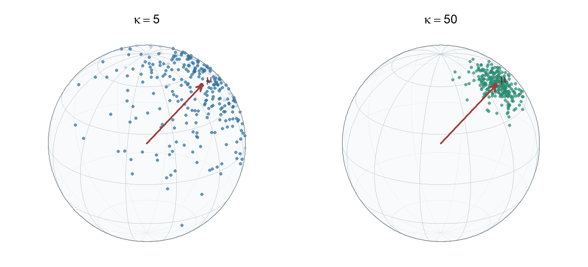

# 연구미팅 자료: Centered - $\eta$ Group Penalty (2026-07-21)

## 1. vMF 혼합분포와 변수선택 목표

$$x_i\in\mathbb S^{d-1},\qquad \lVert x_i\rVert_2=1.$$

$$f(x_i\mid z_i=k,\mu_k,\kappa_k)=C_d(\kappa_k)\exp(\kappa_k\mu_k^\top x_i),\qquad \lVert\mu_k\rVert_2=1,\quad \kappa_k\geq0.$$

$$C_d(\kappa)=\frac{\kappa^{d/2-1}}{(2\pi)^{d/2}I_{d/2-1}(\kappa)}.$$

### 1.1 모수 관계와 component-level 유일성

$$\eta_k=\kappa_k\mu_k,\qquad \eta_k\neq0\ \Longrightarrow\ \kappa_k=\lVert\eta_k\rVert_2>0,\quad \mu_k=\frac{\eta_k}{\lVert\eta_k\rVert_2}\quad\text{(unique)}.$$

$$\eta_k=0\ \Longrightarrow\ \kappa_k=0,\qquad \mu_k\ \text{is not identified}.$$

위 유일성은 component-level 관계이며 mixture label switching은 별도이다.

$$p(x_i;\Theta)=\sum_{k=1}^K\pi_k C_d(\kappa_k)\exp(\kappa_k\mu_k^\top x_i),\qquad \pi_k>0,\quad \sum_{k=1}^K\pi_k=1.$$

$$S_{\mathrm{dec}}=\{j:\exists\,k\neq\ell,\ \eta_{kj}\neq\eta_{\ell j}\}.$$

## 2. $\mu$가 아닌 자연모수 $\eta$

$$p(x_i;\Theta)=\sum_{k=1}^K\pi_k C_d(\lVert\eta_k\rVert_2)\exp(\eta_k^\top x_i).$$

$$\tau_{ik}=P(z_i=k\mid x_i)=\frac{\pi_k C_d(\lVert\eta_k\rVert_2)e^{\eta_k^\top x_i}}{\sum_{\ell=1}^K\pi_\ell C_d(\lVert\eta_\ell\rVert_2)e^{\eta_\ell^\top x_i}}.$$

$$\log\frac{\tau_{ik}}{\tau_{i\ell}}=\log\frac{\pi_k}{\pi_\ell}+\log\frac{C_d(\lVert\eta_k\rVert_2)}{C_d(\lVert\eta_\ell\rVert_2)}+(\eta_k-\eta_\ell)^\top x_i.$$

$$\boxed{\text{posterior decision parameter}=\eta_k=\kappa_k\mu_k}$$

## 3. Raw $\eta$가 아닌 centered $\eta$

$$\eta_{\cdot j}=\bar\eta_j\mathbf 1+c_{\cdot j},\qquad \bar\eta_j=\frac1K\sum_{k=1}^K\eta_{kj},\qquad \mathbf 1^\top c_{\cdot j}=0.$$

$$\eta_{kj}-\eta_{\ell j}=c_{kj}-c_{\ell j}.$$

$$\boxed{S_{\mathrm{dec}}=\{j:\lVert c_{\cdot j}\rVert_2>0\}}.$$

$$c_{\cdot j}=0\quad\Longleftrightarrow\quad \eta_{1j}=\cdots=\eta_{Kj}=\bar\eta_j.$$

공통 효과 $\bar\eta_j$는 유지되지만 decision support에는 포함되지 않는다.

## 4. 목적함수와 coordinate-wise group penalty

$$\ell(\Theta)=\sum_{i=1}^n\log\{\sum_{k=1}^K\pi_k C_d(\lVert\eta_k\rVert_2)\exp(\eta_k^\top x_i)\}.$$

E-CGL:

$$\boxed{\widehat\Theta_{\lambda_\eta}^{\mathrm{E-CGL}}=\underset{\Theta}{\arg\max}\{\ell(\Theta)-\lambda_\eta\sum_{j=1}^d\lVert c_{\cdot j}\rVert_2\}}.$$

$$\mathrm{prox}_{\lambda_\eta/L}(\widetilde c_{\cdot j})=(1-\frac{\lambda_\eta}{L\lVert\widetilde c_{\cdot j}\rVert_2})_+\widetilde c_{\cdot j}.$$

E-ACGL:

$$\widehat\Theta_{\lambda_\eta}^{\mathrm{E-ACGL}}=\underset{\Theta}{\arg\max}\{\ell(\Theta)-\lambda_\eta\sum_{j=1}^d w_j\lVert c_{\cdot j}\rVert_2\}.$$

$$w_j=(\lVert c_{\cdot j}^{\mathrm{init}}\rVert_2+\epsilon)^{-\gamma},\qquad \gamma=1,\quad \epsilon=10^{-6}.$$

E-CGL은 주 모형, E-ACGL은 adaptive 확장이다.

## 5. 핵심 시뮬레이션 근거

$$e_B=P\{\underset{k}{\arg\max}\ P(Z=k\mid X;\Theta)\neq Z\}.$$

$$\eta_k(A)=a(A)+b_k(A),\qquad a(A)^\top b_k(A)=0.$$

$$\lVert a(A)\rVert_2=A,\qquad \lVert b_k(A)\rVert_2=\sqrt{\kappa_k^2-A^2}\quad\Longrightarrow\quad \lVert\eta_k(A)\rVert_2=\kappa_k.$$

$$\widehat e_B(A)=\frac1M\sum_{m=1}^M\mathbf{1}\left\{\underset{k}{\arg\max}\ P(Z_m=k\mid X_m;\Theta(A))\neq Z_m\right\},\qquad A^*: \widehat e_B(A^*)\simeq e_B^{\mathrm{target}}.$$

$\kappa_k$는 고정하고 $A$를 이분법으로 조정한 뒤 독립 Monte Carlo 표본에서 달성한 $e_B$를 확인했다.

E 계열은 true-PG, 120-point path, BIC-after centered-support refit을 사용했다.

### 5.1 Sparse decision support의 어려운 조건

$$(q_C,q_D,q_N)=(4,16,180),\qquad e_B=0.10,\qquad n=300,\qquad \kappa=(30,40,50,60),\qquad \mathrm{rep}=20.$$

| 모형 | selected $q$ | decision $q$ | noise $q$ | F1 | ARI | $\mathrm{MSE}_{\eta^c}$ |
|:---|---:|---:|---:|---:|---:|---:|
| **E-CGL** | 20.75 | 14.55 | 6.10 | 0.808 | 0.613 | 0.915 |
| E-ACGL | 14.80 | 14.45 | 0.35 | 0.937 | 0.679 | 0.577 |

### 5.2 공통 변수가 많은 조건

$$(q_C,q_D,q_N)=(80,20,100),\qquad n=1000,\qquad e_B=0.05,\qquad \kappa=(30,40,50,60),\qquad \mathrm{rep}=50.$$

| 모형 | common $q$ | decision $q$ | noise $q$ | F1 | ARI |
|:---|---:|---:|---:|---:|---:|
| M-GL | 15.26 | 20.00 | 0.00 | 0.766 | 0.865 |
| M-AGL | 21.16 | 20.00 | 0.02 | 0.695 | 0.861 |
| **E-CGL** | 0.00 | 20.00 | 0.02 | 1.000 | 0.868 |
| E-ACGL | 0.00 | 20.00 | 0.02 | 1.000 | 0.868 |

$$\boxed{\text{prototype support}\neq\text{posterior decision support}}.$$

$$\boxed{\eta\longrightarrow\eta-\bar\eta\longrightarrow\text{coordinate-wise group selection}}.$$
