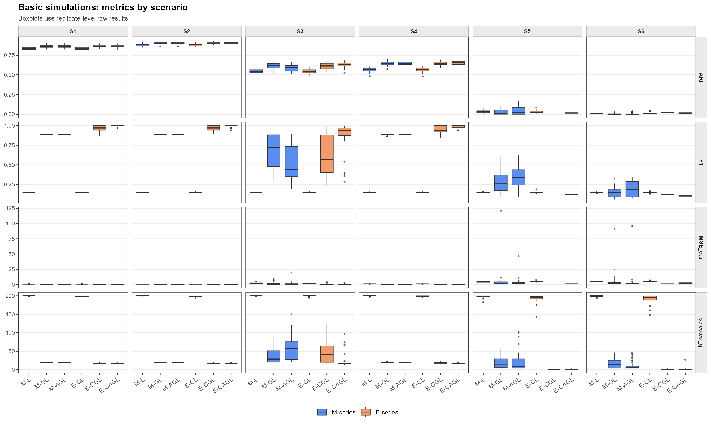
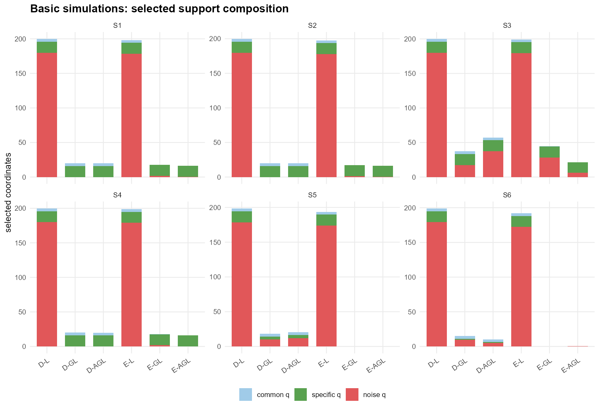
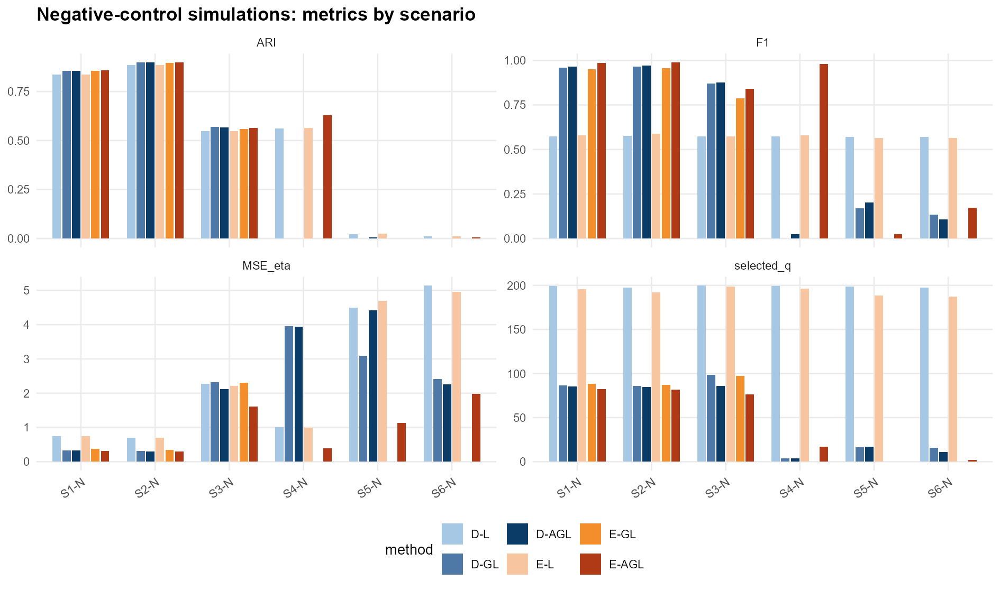
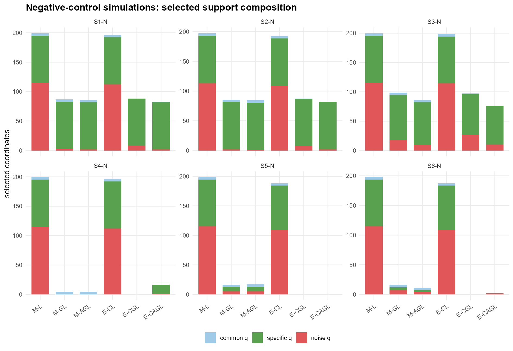
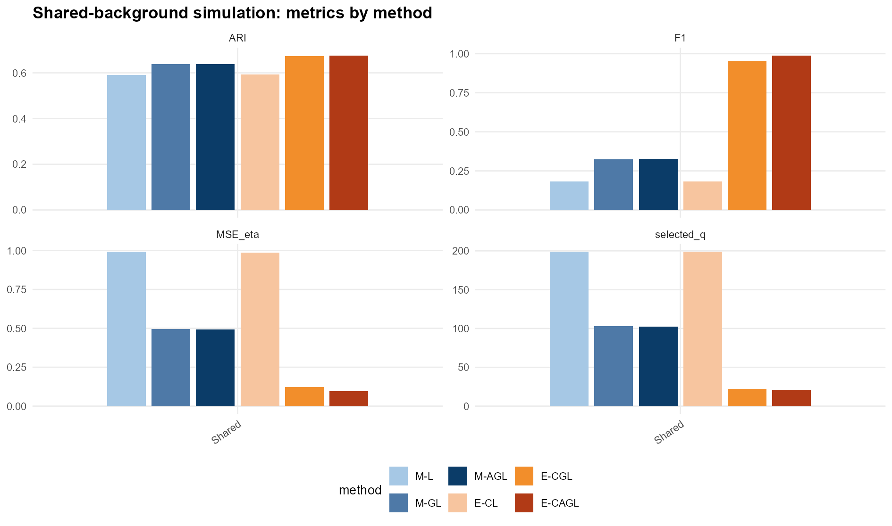
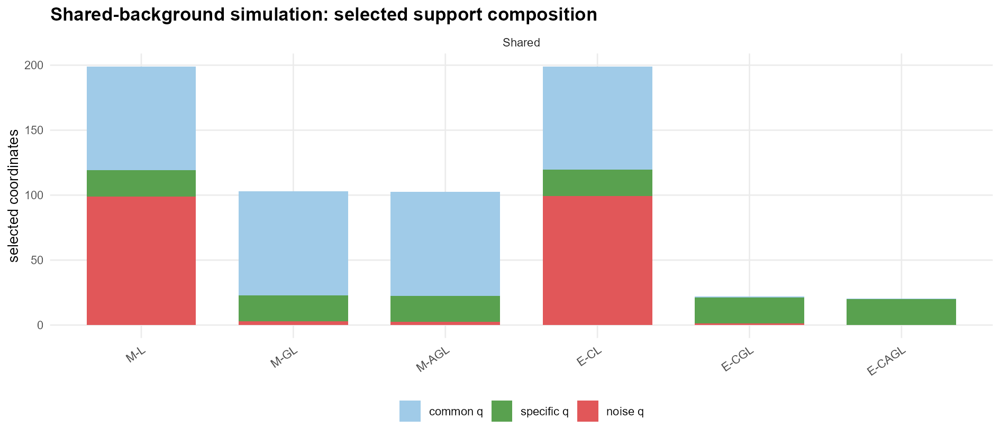

# 논문용 시뮬레이션 요약 260714

## 1. 목적

7월 14일 연구미팅 공유용으로, 논문용 후보 시뮬레이션 S1-S6 결과를 정리한다.
이번 시뮬레이션의 주요 평가 기준은 군집 정확도 자체보다 사후 군집 결정에 쓰이는 support를 얼마나 잘 복원하는가이다.

제안 모형의 목표 support는 중심화 eta 대비(centered eta contrast)

$$
c_{kj}=\eta_{kj}-\bar{\eta}_j,\qquad \eta_k=\kappa_k\mu_k
$$

에서 0이 아닌 좌표이다. 따라서 common variable은 $\mu$에는 존재할 수 있지만 모든 성분에 같은 방향으로 들어가므로 decision support에는 포함하지 않는다.

## 2. 기본 시뮬레이션

### 2.1 시뮬레이션 설정

공통 설정:

| 항목 | 값 |
|---|---:|
| $K$ | 4 |
| $n$ | 1000 |
| $d$ | 200 |
| common q | 4 |
| specific q | 16 |
| noise q | 180 |
| 참 decision $q$ | 16 |
| 초기값 반복 | nstart = 10 |
| 경로 길이 | 240 |
| 선택 기준 | BIC |
| 재적합 | 모든 모형 적용 |
| 반복 수 | 50 |

시나리오 설계:

| 시나리오 | 평균 방향 차이 | 집중도 차이 | 집중도 |
|---|---|---|---|
| S1 | 큼 (90도) | 있음 | (30, 40, 50, 60) |
| S2 | 큼 (90도) | 없음 | (45, 45, 45, 45) |
| S3 | 보통 (60도) | 있음 | (30, 40, 50, 60) |
| S4 | 보통 (60도) | 없음 | (45, 45, 45, 45) |
| S5 | 작음 (30도) | 있음 | (43, 44, 46, 47) |
| S6 | 작음 (30도) | 없음 | (45, 45, 45, 45) |

비교 모형:

| 모형 | 패널티 대상 | 그룹 패널티 | 적응형 적용 |
|---|---|---:|---:|
| M-L | 방향 $\mu_{kj}$ | 없음 | 없음 |
| M-GL | 방향 $\mu_{\cdot j}$ | 있음 | 없음 |
| M-AGL | 방향 $\mu_{\cdot j}$ | 있음 | 있음 |
| E-CL | 중심화 eta 개별 entry $c_{kj}$ | 없음 | 없음 |
| E-CGL | 중심화 eta 좌표 $c_{\cdot j}$ | 있음 | 없음 |
| E-CAGL | 중심화 eta 좌표 $c_{\cdot j}$ | 있음 | 있음 |

외부 비교 모형 후보:

| 외부 모형 | 역할 | S1-S6에서의 사용 목적 | support 지표 | 비고 |
|---|---|---|---|---|
| Spherical k-means | 표준 방향 clustering baseline | cosine 기반 hard clustering 성능 비교 | 없음 | ARI/NMI/purity 중심으로 비교 |
| Dense vMF mixture, free kappa | penalty 없는 확률모형 baseline | sparse penalty 없이 vMF likelihood만 쓸 때의 기준 | 없음 | cluster별 $\kappa_k$를 추정하므로 spherical k-means보다 일반적 |
| Sparse k-means | 일반 feature-selection clustering baseline | likelihood 모형이 아닌 sparse clustering과 비교 | feature support | posterior decision support와 목표가 다르므로 보조 지표로 해석 |
| dbmovMFs | 구조적 sparse vMF baseline | vMF co-clustering 구조와 비교 | 구조적 feature/block support | 구현 가능하면 appendix 비교 후보 |

외부 모형은 내부 ablation 모형과 목적이 다르다. Spherical k-means와 dense vMF는 support recovery 모형이 아니므로 clustering 성능만 비교하고, Sparse k-means와 dbmovMFs의 support는 posterior decision support가 아니라 feature/prototype 또는 block support로 해석한다.

모형별 패널티와 매개변수:

| 모형 | 패널티 형태 | adaptive weight 설정 |
|---|---|---|
| M-L | $\lambda_\mu \sum_{k,j}\lvert \mu_{kj}\rvert$ | 없음 |
| M-GL | $\lambda_\mu \sum_j \|\mu_{\cdot j}\|_2$ | 없음 |
| M-AGL | $\lambda_\mu \sum_j w_j^{(M)}\|\mu_{\cdot j}\|_2$ | $w_j^{(M)}=(\|\mu_{\cdot j}^{init}\|_2+\epsilon)^{-\gamma}$ |
| E-CL | $\lambda_\eta \sum_{k,j}\lvert c_{kj}\rvert$ | 없음 |
| E-CGL | $\lambda_\eta \sum_j \|c_{\cdot j}\|_2$ | 없음 |
| E-CAGL | $\lambda_\eta \sum_j w_j^{(E)}\|c_{\cdot j}\|_2$ | $w_j^{(E)}=(\|c_{\cdot j}^{init}\|_2+\epsilon)^{-\gamma}$ |

여기서 $c_{kj}=\eta_{kj}-\bar{\eta}_j$이다. Adaptive 모형에서는 $\gamma=1$, $\epsilon=10^{-6}$을 사용했고, 계산된 weight는 median이 1이 되도록 정규화했다. 모든 모형은 BIC로 tuning parameter를 선택한 뒤 선택된 support에서 재적합했다.

평가 지표:

- `selected q`: 선택된 좌표 총수.
- `common q`: 선택된 common variable 수. 이상적인 값은 0.
- `specific q`: 선택된 specific variable 수. 이상적인 값은 16.
- `noise q`: 선택된 noise variable 수. 이상적인 값은 0.
- `MSE_eta`: 중심화 eta 대비 기준 MSE.

### 2.1.1 시각화 요약

아래 그림은 S1-S6의 내부 6개 모형 결과를 같은 축에서 비교한 것이다. 첫 번째 그림은 ARI, selected q, F1, MSE_eta를 요약하고, 두 번째 그림은 선택된 좌표가 common q, specific q, noise q 중 어디에 해당하는지 나타낸다.

### 2.2 S1: 평균 차이 큼 (90도) + 집중도 이분산

설정: 목표 각도 90도, $\kappa=(30,40,50,60)$.

| 모형 | ARI | selected q | common q | specific q | noise q | TPR | FPR | Precision | F1 | MSE_mu | MSE_kappa | MSE_eta |
|---|---:|---:|---:|---:|---:|---:|---:|---:|---:|---:|---:|---:|
| M-L | 0.837 | 199.80 | 4.00 | 16.00 | 179.80 | 1.000 | 0.999 | 0.080 | 0.148 | 0.000526 | 6.230 | 0.738 |
| M-GL | 0.863 | 20.00 | 4.00 | 16.00 | 0.00 | 1.000 | 0.022 | 0.800 | 0.889 | 0.000052 | 1.039 | 0.069 |
| M-AGL | 0.863 | 20.00 | 4.00 | 16.00 | 0.00 | 1.000 | 0.022 | 0.800 | 0.889 | 0.000052 | 1.039 | 0.069 |
| E-CL | 0.837 | 198.10 | 3.96 | 16.00 | 178.14 | 1.000 | 0.990 | 0.081 | 0.149 | 0.000539 | 6.115 | 0.737 |
| E-CGL | 0.865 | 17.44 | 0.02 | 16.00 | 1.42 | 1.000 | 0.008 | 0.924 | 0.959 | 0.001528 | 39.821 | 0.078 |
| E-CAGL | 0.865 | 16.06 | 0.00 | 16.00 | 0.06 | 1.000 | 0.000 | 0.996 | 0.998 | 0.001520 | 41.107 | 0.057 |

외부 clustering baseline:

| 외부 모형 | ARI | NMI | purity | selected q | F1 | support 해석 |
|---|---:|---:|---:|---:|---:|---|
| Spherical k-means | 0.768 | 0.740 | 0.903 | NA | NA | support 없음 |
| Dense vMF free kappa | 0.836 | 0.801 | 0.934 | NA | NA | support 없음 |
| Sparse k-means | 0.669 | 0.669 | 0.826 | 52.36 | 0.674 | feature support, posterior decision support 아님 |

해석:

- M-L과 E-CL은 거의 모든 변수를 선택한다.
- M-GL과 M-AGL은 noise는 제거하지만 common variable 4개를 모두 유지한다.
- E-CAGL은 참 decision support에 가장 가깝다: selected q = 16.06, common q = 0.00, noise q = 0.06.

### 2.3 S2: 평균 차이 큼 (90도) + 집중도 등분산

설정: 목표 각도 90도, $\kappa=(45,45,45,45)$.

| 모형 | ARI | selected q | common q | specific q | noise q | TPR | FPR | Precision | F1 | MSE_mu | MSE_kappa | MSE_eta |
|---|---:|---:|---:|---:|---:|---:|---:|---:|---:|---:|---:|---:|
| M-L | 0.881 | 199.68 | 4.00 | 16.00 | 179.68 | 1.000 | 0.998 | 0.080 | 0.148 | 0.000425 | 5.326 | 0.708 |
| M-GL | 0.903 | 20.00 | 4.00 | 16.00 | 0.00 | 1.000 | 0.022 | 0.800 | 0.889 | 0.000042 | 1.204 | 0.070 |
| M-AGL | 0.903 | 20.00 | 4.00 | 16.00 | 0.00 | 1.000 | 0.022 | 0.800 | 0.889 | 0.000042 | 1.203 | 0.070 |
| E-CL | 0.881 | 197.50 | 3.92 | 16.00 | 177.58 | 1.000 | 0.986 | 0.081 | 0.150 | 0.000450 | 5.039 | 0.707 |
| E-CGL | 0.904 | 17.06 | 0.00 | 16.00 | 1.06 | 1.000 | 0.006 | 0.941 | 0.969 | 0.001387 | 41.603 | 0.072 |
| E-CAGL | 0.904 | 16.12 | 0.00 | 16.00 | 0.12 | 1.000 | 0.001 | 0.993 | 0.996 | 0.001378 | 42.199 | 0.057 |

외부 clustering baseline:

| 외부 모형 | ARI | NMI | purity | selected q | F1 | support 해석 |
|---|---:|---:|---:|---:|---:|---|
| Spherical k-means | 0.877 | 0.829 | 0.952 | NA | NA | support 없음 |
| Dense vMF free kappa | 0.880 | 0.833 | 0.954 | NA | NA | support 없음 |
| Sparse k-means | 0.815 | 0.772 | 0.915 | 132.78 | 0.413 | feature support, posterior decision support 아님 |

해석:

- 집중도가 같아져도 S1에서 보인 패턴은 유지된다.
- 방향 기반 그룹 패널티 모형은 여전히 common variable 4개를 유지한다.
- E-CAGL은 이 경우에도 decision support를 거의 정확하게 복원한다.

### 2.4 S3: 평균 차이 보통 (60도) + 집중도 이분산

설정: 목표 각도 60도, $\kappa=(30,40,50,60)$.
실제 쌍별 방향 각도의 평균/최소/최대는 66.02/42.07/86.06도이므로, S1-S4 중 가장 어려운 설정이다.

| 모형 | ARI | selected q | common q | specific q | noise q | TPR | FPR | Precision | F1 | MSE_mu | MSE_kappa | MSE_eta |
|---|---:|---:|---:|---:|---:|---:|---:|---:|---:|---:|---:|---:|
| M-L | 0.546 | 199.94 | 4.00 | 16.00 | 179.94 | 1.000 | 1.000 | 0.080 | 0.148 | 0.001309 | 120.607 | 2.377 |
| M-GL | 0.613 | 37.24 | 4.00 | 16.00 | 17.24 | 1.000 | 0.115 | 0.549 | 0.677 | 0.000506 | 143.148 | 1.308 |
| M-AGL | 0.587 | 57.26 | 4.00 | 16.00 | 37.26 | 1.000 | 0.224 | 0.396 | 0.528 | 0.000598 | 110.669 | 1.299 |
| E-CL | 0.544 | 199.20 | 3.94 | 16.00 | 179.26 | 1.000 | 0.996 | 0.080 | 0.149 | 0.001308 | 82.063 | 2.124 |
| E-CGL | 0.609 | 44.70 | 0.60 | 15.94 | 28.16 | 0.996 | 0.156 | 0.495 | 0.618 | 0.003631 | 157.113 | 0.755 |
| E-CAGL | 0.631 | 21.22 | 0.12 | 15.02 | 6.08 | 0.939 | 0.034 | 0.877 | 0.881 | 0.004147 | 234.696 | 0.250 |

외부 clustering baseline:

| 외부 모형 | ARI | NMI | purity | selected q | F1 | support 해석 |
|---|---:|---:|---:|---:|---:|---|
| Spherical k-means | 0.492 | 0.498 | 0.713 | NA | NA | support 없음 |
| Dense vMF free kappa | 0.539 | 0.552 | 0.732 | NA | NA | support 없음 |
| Sparse k-means | 0.488 | 0.505 | 0.702 | 162.48 | 0.205 | feature support, posterior decision support 아님 |

해석:

- S3는 스트레스 테스트 설정으로, 모든 모형에서 군집 성능과 support 복원이 약해진다.
- E-CAGL도 모든 decision 변수를 전부 복원하지는 못하지만, 다른 모형보다 덜 조밀하게 선택한다.
- 이 설정에서 E-CAGL은 ARI, F1, FPR, MSE_eta 기준으로 상대적으로 높은 성능을 보인다.

### 2.5 S4: 평균 차이 보통 (60도) + 집중도 등분산

설정: 목표 각도 60도, $\kappa=(45,45,45,45)$.

| 모형 | ARI | selected q | common q | specific q | noise q | TPR | FPR | Precision | F1 | MSE_mu | MSE_kappa | MSE_eta |
|---|---:|---:|---:|---:|---:|---:|---:|---:|---:|---:|---:|---:|
| M-L | 0.564 | 199.80 | 4.00 | 16.00 | 179.80 | 1.000 | 0.999 | 0.080 | 0.148 | 0.000555 | 8.878 | 1.011 |
| M-GL | 0.647 | 20.24 | 4.00 | 16.00 | 0.24 | 1.000 | 0.023 | 0.791 | 0.883 | 0.000056 | 1.602 | 0.097 |
| M-AGL | 0.648 | 20.00 | 4.00 | 16.00 | 0.00 | 1.000 | 0.022 | 0.800 | 0.889 | 0.000053 | 1.608 | 0.093 |
| E-CL | 0.563 | 198.88 | 4.00 | 16.00 | 178.88 | 1.000 | 0.994 | 0.080 | 0.149 | 0.000555 | 8.833 | 1.010 |
| E-CGL | 0.648 | 17.76 | 0.06 | 16.00 | 1.70 | 1.000 | 0.010 | 0.908 | 0.950 | 0.003898 | 314.002 | 0.103 |
| E-CAGL | 0.651 | 16.32 | 0.02 | 16.00 | 0.30 | 1.000 | 0.002 | 0.982 | 0.990 | 0.003924 | 323.765 | 0.079 |

외부 clustering baseline:

| 외부 모형 | ARI | NMI | purity | selected q | F1 | support 해석 |
|---|---:|---:|---:|---:|---:|---|
| Spherical k-means | 0.508 | 0.461 | 0.783 | NA | NA | support 없음 |
| Dense vMF free kappa | 0.561 | 0.508 | 0.812 | NA | NA | support 없음 |
| Sparse k-means | 0.129 | 0.139 | 0.470 | 73.10 | 0.367 | feature support, posterior decision support 아님 |

해석:

- 평균 방향 차이가 보통(60도)인 경우에도, 집중도가 같으면 S3보다 더 깔끔한 패턴이 나타난다.
- M-GL/M-AGL은 이 경우에도 common variable을 모두 유지한다.
- E-CAGL은 목표 decision support에 가장 가깝다.

### 2.6 S5: 평균 차이 작음 (30도) + 집중도 이분산

설정: 목표 각도 30도, kappa=(43,44,46,47).
실제 쌍별 방향 각도의 평균/최소/최대는 29.47/19.34/38.49도이다. 강한 이분산 kappa=(30,40,50,60)에서는 30도 평균 방향 차이가 잘 생성되지 않았으므로, S5는 약한 이분산 구조로 재설정했다.

| 모형 | ARI | selected q | common q | specific q | noise q | TPR | FPR | Precision | F1 | MSE_mu | MSE_kappa | MSE_eta |
|---|---:|---:|---:|---:|---:|---:|---:|---:|---:|---:|---:|---:|
| M-L | 0.031 | 198.56 | 4.00 | 16.00 | 178.56 | 1.000 | 0.992 | 0.081 | 0.149 | 0.002 | 112.405 | 4.395 |
| M-GL | 0.027 | 18.18 | 4.00 | 4.20 | 9.98 | 0.263 | 0.076 | 0.200 | 0.284 | 0.001 | 749.811 | 5.370 |
| M-AGL | 0.039 | 20.64 | 4.00 | 4.88 | 11.76 | 0.305 | 0.086 | 0.184 | 0.342 | 0.001 | 345.094 | 3.318 |
| E-CL | 0.029 | 193.48 | 3.78 | 15.82 | 173.88 | 0.989 | 0.966 | 0.082 | 0.151 | 0.002 | 121.131 | 4.691 |
| E-CGL | NA | 0.00 | 0.00 | 0.00 | 0.00 | 0.000 | 0.000 | NA | NA | NA | NA | NA |
| E-CAGL | 0.015 | 0.02 | 0.00 | 0.02 | 0.00 | 0.001 | 0.000 | 1.000 | 0.118 | 0.009 | 1539.065 | 1.040 |

외부 clustering baseline:

| 외부 모형 | ARI | NMI | purity | selected q | F1 | support 해석 |
|---|---:|---:|---:|---:|---:|---|
| Spherical k-means | 0.015 | 0.019 | 0.324 | NA | NA | support 없음 |
| Dense vMF free kappa | 0.029 | 0.036 | 0.348 | NA | NA | support 없음 |
| Sparse k-means | 0.023 | 0.031 | 0.337 | 99.40 | 0.173 | feature support, posterior decision support 아님 |

해석:

- S5는 실제 30도 근처의 평균 방향 차이를 갖는 이분산 stress setting이다.
- 모든 모형에서 ARI가 거의 0에 가깝고, E-CGL은 BIC에서 zero support를 선택했다.
- 이 결과는 평균 방향 차이가 30도 수준으로 작아지면 집중도 차이가 약하게 있어도 clustering과 decision support recovery가 크게 어려워진다는 한계 진단이다.

### 2.7 S6: 평균 차이 작음 (30도) + 집중도 등분산

설정: 목표 각도 30도, kappa=(45,45,45,45).
실제 쌍별 방향 각도의 평균/최소/최대는 30.00/30.00/30.00도이다.

| 모형 | ARI | selected q | common q | specific q | noise q | TPR | FPR | Precision | F1 | MSE_mu | MSE_kappa | MSE_eta |
|---|---:|---:|---:|---:|---:|---:|---:|---:|---:|---:|---:|---:|
| M-L | 0.010 | 199.02 | 4.00 | 15.90 | 179.12 | 0.994 | 0.995 | 0.080 | 0.148 | 0.001997 | 118.684 | 4.900 |
| M-GL | 0.004 | 15.24 | 4.00 | 1.54 | 9.70 | 0.096 | 0.074 | 0.077 | 0.152 | 0.001017 | 619.062 | 4.879 |
| M-AGL | 0.005 | 10.28 | 4.00 | 1.30 | 4.98 | 0.081 | 0.049 | 0.057 | 0.192 | 0.000826 | 527.888 | 3.965 |
| E-CL | 0.012 | 191.94 | 3.82 | 15.60 | 172.52 | 0.975 | 0.958 | 0.081 | 0.150 | 0.002198 | 101.513 | 4.729 |
| E-CGL | 0.017 | 0.02 | 0.00 | 0.02 | 0.00 | 0.001 | 0.000 | 1.000 | 0.118 | 0.009542 | 1662.998 | 1.020 |
| E-CAGL | 0.012 | 0.56 | 0.02 | 0.06 | 0.48 | 0.004 | 0.003 | 0.537 | 0.105 | 0.007952 | 946.052 | 2.354 |

외부 clustering baseline:

| 외부 모형 | ARI | NMI | purity | selected q | F1 | support 해석 |
|---|---:|---:|---:|---:|---:|---|
| Spherical k-means | 0.009 | 0.013 | 0.311 | NA | NA | support 없음 |
| Dense vMF free kappa | 0.011 | 0.018 | 0.317 | NA | NA | support 없음 |
| Sparse k-means | 0.010 | 0.016 | 0.312 | 105.30 | 0.142 | feature support, posterior decision support 아님 |

해석:

- S6는 실제 30도 평균 방향 차이를 갖는 가장 강한 stress setting이다.
- 모든 모형에서 ARI가 거의 0에 가깝고, E-CGL/E-CAGL은 대부분 zero-support에 가까운 선택을 한다.
- 이 결과는 평균 방향 차이가 지나치게 작을 때 posterior decision support recovery 자체가 어려워지는 한계 진단으로 해석한다.

### 2.8 기본 시뮬레이션 결론

| 시나리오 | Decision support 기준 최선 모형 | 주요 패턴 |
|---|---|---|
| S1 | E-CAGL | Decision support를 거의 정확하게 복원한다. |
| S2 | E-CAGL | 집중도가 같아도 S1과 같은 패턴이 유지된다. |
| S3 | E-CAGL | 어려운 스트레스 설정이지만 E-CAGL이 덜 조밀하고 F1/MSE_eta가 상대적으로 높다. |
| S4 | E-CAGL | 평균 차이가 보통(60도)이어도 집중도가 같으면 E-CAGL의 selected q가 참 q와 가깝다. |
| S5 | 없음 | 약한 이분산으로 실제 30도 근처를 만들었지만, 모든 모형의 clustering과 support recovery가 크게 약해진다. |
| S6 | 없음 | 실제 30도 등분산 stress setting에서는 모든 모형의 clustering과 support recovery가 크게 약해진다. |

핵심 해석:

- 개별 entry 패널티인 M-L과 E-CL은 거의 모든 좌표를 유지하는 경향이 있다.
- 방향 그룹 패널티인 M-GL과 M-AGL은 대부분의 노이즈를 제거하지만 공통 좌표도 함께 유지한다.
- Eta-group 패널티인 E-CGL과 E-CAGL은 posterior decision support를 직접 목표로 하므로 공통 좌표를 제거한다.
- S1-S4 전체에서 decision-support recovery 기준으로는 E-CAGL의 성능이 일관되게 높게 나타난다. S5/S6는 평균 방향 차이를 30도 수준으로 낮춘 stress 진단으로 별도 해석한다.

주의할 점:

- E-CGL과 E-CAGL은 공통 좌표를 제거하면서 전체 eta norm도 함께 줄이므로 MSE_kappa가 크게 나타난다.
- 이는 중심화 eta 대비를 목표로 할 때 예상 가능한 패턴이다.
- 본 논문에서는 MSE_eta와 decision support recovery를 주요 추정 목표로 보고, MSE_kappa는 보조 진단 지표로 제시한다.

## 3. Negative-control 시뮬레이션

### 3.1 목적

외부 baseline도 기본 시뮬레이션과 같은 protocol로 S1-N~S6-N에 대해 계산했다. Spherical k-means와 Dense vMF free kappa는 clustering baseline이며, Sparse k-means support는 posterior decision support가 아니라 feature support로 해석한다.

기본 시뮬레이션은 true decision support가 16개인 sparse decision-support setting이다. Negative-control 시뮬레이션에서는 평균 방향 차이와 집중도 차이의 두 축은 유지하되, decision variable 수를 80개로 늘려 Eta-group 계열이 sparse setting만 다루는 것이 아님을 확인한다.

이번 결과는 dense decision support에 대한 `rep=50 diagnostic`이다. S1-N~S4-N 전체 요약은 `results/paper_eta_negative_control_s1n_s4n_rep50_260702/paper_eta_negative_control_s1n_s4n_rep50_summary.csv`에 저장했고, S5-N/S6-N은 각 scenario 결과 폴더의 summary를 사용했다.

### 3.2 설정

공통 조건: `K=4`, `n=1000`, `d=200`, `common q=4`, `decision q=80`, `noise q=116`, `true decision q=80`, `nstart=10`, path length `240`, BIC 선택, support refit 적용 가능한 경우 refit.

| Scenario | 평균 방향 차이 | 집중도 차이 | 집중도 | common q | decision q | noise q | true decision q |
|---|---|---|---|---:|---:|---:|---:|
| S1-N | 큼 (90도) | 있음 | (30, 40, 50, 60) | 4 | 80 | 116 | 80 |
| S2-N | 큼 (90도) | 없음 | (45, 45, 45, 45) | 4 | 80 | 116 | 80 |
| S3-N | 보통 (60도) | 있음 | (30, 40, 50, 60) | 4 | 80 | 116 | 80 |
| S4-N | 보통 (60도) | 없음 | (45, 45, 45, 45) | 4 | 80 | 116 | 80 |
| S5-N | 작음 (30도) | 있음 | (43, 44, 46, 47) | 4 | 80 | 116 | 80 |
| S6-N | 작음 (30도) | 없음 | (45, 45, 45, 45) | 4 | 80 | 116 | 80 |

### 3.3 rep=50 결과 요약

아래 표는 2장의 기본 시뮬레이션 결과표와 같은 양식으로 정리했다. 여기서 specific q는 negative-control에서 dense decision variable 선택 수를 뜻한다.

아래 그림은 S1-N~S6-N의 내부 6개 모형 결과를 요약한다. Negative-control에서는 selected q와 support 구성의 변화가 Eta-group 계열의 과소선택 또는 zero-support tuning failure를 확인하는 주요 지표다.

#### S1-N: 평균 차이 큼 (90도) + 집중도 이분산

| 모형 | ARI | selected q | common q | specific q | noise q | TPR | FPR | Precision | F1 | MSE_mu | MSE_kappa | MSE_eta |
|---|---:|---:|---:|---:|---:|---:|---:|---:|---:|---:|---:|---:|
| M-L | 0.837 | 199.04 | 4.00 | 80.00 | 115.04 | 1.000 | 0.992 | 0.402 | 0.573 | 0.000530 | 6.356 | 0.743 |
| M-GL | 0.854 | 86.66 | 4.00 | 80.00 | 2.66 | 1.000 | 0.056 | 0.924 | 0.960 | 0.000260 | 2.099 | 0.335 |
| M-AGL | 0.857 | 85.48 | 4.00 | 79.96 | 1.52 | 1.000 | 0.046 | 0.936 | 0.966 | 0.000251 | 1.999 | 0.326 |
| E-CL | 0.837 | 195.86 | 3.86 | 80.00 | 112.00 | 1.000 | 0.966 | 0.409 | 0.580 | 0.000578 | 5.836 | 0.742 |
| E-CGL | 0.855 | 88.34 | 0.22 | 79.98 | 8.14 | 1.000 | 0.070 | 0.907 | 0.951 | 0.001711 | 23.315 | 0.374 |
| E-CAGL | 0.857 | 82.40 | 0.14 | 79.98 | 2.28 | 1.000 | 0.020 | 0.971 | 0.985 | 0.001704 | 25.910 | 0.318 |

외부 clustering baseline:

| 외부 모형 | ARI | NMI | purity | selected q | F1 | support 해석 |
|---|---:|---:|---:|---:|---:|---|
| Spherical k-means | 0.770 | 0.740 | 0.904 | NA | NA | support 없음 |
| Dense vMF free kappa | 0.835 | 0.802 | 0.934 | NA | NA | support 없음 |
| Sparse k-means | 0.133 | 0.155 | 0.437 | 82.16 | 0.574 | feature support, posterior decision support 아님 |

#### S2-N: 평균 차이 큼 (90도) + 집중도 등분산

| 모형 | ARI | selected q | common q | specific q | noise q | TPR | FPR | Precision | F1 | MSE_mu | MSE_kappa | MSE_eta |
|---|---:|---:|---:|---:|---:|---:|---:|---:|---:|---:|---:|---:|
| M-L | 0.886 | 197.22 | 4.00 | 80.00 | 113.22 | 1.000 | 0.977 | 0.406 | 0.577 | 0.000422 | 5.320 | 0.701 |
| M-GL | 0.899 | 85.66 | 4.00 | 80.00 | 1.66 | 1.000 | 0.047 | 0.934 | 0.966 | 0.000192 | 1.948 | 0.306 |
| M-AGL | 0.898 | 84.58 | 4.00 | 80.00 | 0.58 | 1.000 | 0.038 | 0.946 | 0.972 | 0.000184 | 1.874 | 0.295 |
| E-CL | 0.886 | 192.18 | 3.72 | 80.00 | 108.46 | 1.000 | 0.935 | 0.416 | 0.588 | 0.000510 | 4.473 | 0.698 |
| E-CGL | 0.897 | 87.36 | 0.36 | 80.00 | 7.00 | 1.000 | 0.061 | 0.917 | 0.956 | 0.001451 | 25.334 | 0.345 |
| E-CAGL | 0.897 | 81.82 | 0.04 | 80.00 | 1.78 | 1.000 | 0.015 | 0.978 | 0.989 | 0.001535 | 31.435 | 0.292 |

외부 clustering baseline:

| 외부 모형 | ARI | NMI | purity | selected q | F1 | support 해석 |
|---|---:|---:|---:|---:|---:|---|
| Spherical k-means | 0.880 | 0.833 | 0.954 | NA | NA | support 없음 |
| Dense vMF free kappa | 0.886 | 0.839 | 0.956 | NA | NA | support 없음 |
| Sparse k-means | 0.058 | 0.068 | 0.397 | 128.32 | 0.520 | feature support, posterior decision support 아님 |

#### S3-N: 평균 차이 보통 (60도) + 집중도 이분산

| 모형 | ARI | selected q | common q | specific q | noise q | TPR | FPR | Precision | F1 | MSE_mu | MSE_kappa | MSE_eta |
|---|---:|---:|---:|---:|---:|---:|---:|---:|---:|---:|---:|---:|
| M-L | 0.547 | 199.78 | 4.00 | 80.00 | 115.78 | 1.000 | 0.998 | 0.400 | 0.572 | 0.001268 | 111.411 | 2.280 |
| M-GL | 0.569 | 98.40 | 4.00 | 77.16 | 17.24 | 0.965 | 0.177 | 0.796 | 0.869 | 0.001079 | 197.337 | 2.320 |
| M-AGL | 0.568 | 85.84 | 4.00 | 72.62 | 9.22 | 0.908 | 0.110 | 0.856 | 0.877 | 0.001061 | 168.010 | 2.113 |
| E-CL | 0.548 | 198.36 | 3.92 | 79.98 | 114.46 | 1.000 | 0.987 | 0.403 | 0.575 | 0.001342 | 96.061 | 2.205 |
| E-CGL | 0.558 | 97.02 | 1.06 | 69.44 | 26.52 | 0.868 | 0.230 | 0.731 | 0.788 | 0.003628 | 194.378 | 2.309 |
| E-CAGL | 0.565 | 76.06 | 0.38 | 65.44 | 10.24 | 0.818 | 0.089 | 0.870 | 0.840 | 0.004275 | 187.581 | 1.603 |

외부 clustering baseline:

| 외부 모형 | ARI | NMI | purity | selected q | F1 | support 해석 |
|---|---:|---:|---:|---:|---:|---|
| Spherical k-means | 0.488 | 0.492 | 0.711 | NA | NA | support 없음 |
| Dense vMF free kappa | 0.545 | 0.559 | 0.741 | NA | NA | support 없음 |
| Sparse k-means | 0.063 | 0.075 | 0.388 | 91.56 | 0.380 | feature support, posterior decision support 아님 |

#### S4-N: 평균 차이 보통 (60도) + 집중도 등분산

| 모형 | ARI | selected q | common q | specific q | noise q | TPR | FPR | Precision | F1 | MSE_mu | MSE_kappa | MSE_eta |
|---|---:|---:|---:|---:|---:|---:|---:|---:|---:|---:|---:|---:|
| M-L | 0.563 | 199.30 | 4.00 | 80.00 | 115.30 | 1.000 | 0.994 | 0.401 | 0.573 | 0.000553 | 8.860 | 1.002 |
| M-GL | 0.000 | 4.02 | 4.00 | 0.00 | 0.02 | 0.000 | 0.034 | 0.000 | 0.000 | 0.002158 | 95.514 | 3.957 |
| M-AGL | 0.000 | 4.02 | 4.00 | 0.02 | 0.00 | 0.000 | 0.033 | 0.004 | 0.000 | 0.002156 | 96.456 | 3.945 |
| E-CL | 0.564 | 196.04 | 3.80 | 80.00 | 112.24 | 1.000 | 0.967 | 0.408 | 0.580 | 0.000726 | 9.981 | 0.996 |
| E-CGL | NA | 0.00 | 0.00 | 0.00 | 0.00 | 0.000 | 0.000 | NA | 0.000 | NA | NA | NA |
| E-CAGL | 0.629 | 16.70 | 0.00 | 16.00 | 0.70 | 0.200 | 0.006 | 0.959 | 0.331 | 0.004234 | 258.843 | 0.388 |

S4-N에서 E-CAGL은 50회 중 10회만 nonzero support를 선택했다. 표의 F1은 전체 50회 기준으로 재계산한 값이고, nonzero support가 선택된 10회만 보면 F1=0.979이다. 재계산 상세는 `results/paper_eta_s4n_metric_audit_260708/s4n_metric_recheck_notes.md`에 따로 남겼다.

외부 clustering baseline:

| 외부 모형 | ARI | NMI | purity | selected q | F1 | support 해석 |
|---|---:|---:|---:|---:|---:|---|
| Spherical k-means | 0.507 | 0.459 | 0.783 | NA | NA | support 없음 |
| Dense vMF free kappa | 0.562 | 0.510 | 0.812 | NA | NA | support 없음 |
| Sparse k-means | 0.026 | 0.033 | 0.352 | 114.00 | 0.445 | feature support, posterior decision support 아님 |

#### S5-N: 평균 차이 작음 (30도) + 집중도 이분산

설정: 목표 각도 30도, kappa=(43,44,46,47). 실제 쌍별 방향 각도의 평균/최소/최대는 29.47/19.34/38.49도이다.

| 모형 | ARI | selected q | common q | specific q | noise q | TPR | FPR | Precision | F1 | MSE_mu | MSE_kappa | MSE_eta |
|---|---:|---:|---:|---:|---:|---:|---:|---:|---:|---:|---:|---:|
| M-L | 0.023 | 198.52 | 4.00 | 79.50 | 115.02 | 0.994 | 0.992 | 0.400 | 0.571 | 0.002 | 113.941 | 4.499 |
| M-GL | 0.001 | 16.56 | 4.00 | 7.02 | 5.54 | 0.088 | 0.080 | 0.331 | 0.170 | 0.001 | 197.466 | 3.096 |
| M-AGL | 0.005 | 16.80 | 4.00 | 7.48 | 5.32 | 0.094 | 0.078 | 0.293 | 0.201 | 0.001 | 483.095 | 4.417 |
| E-CL | 0.025 | 188.22 | 3.70 | 75.88 | 108.64 | 0.949 | 0.936 | 0.403 | 0.565 | 0.002 | 114.674 | 4.693 |
| E-CGL | NA | 0.00 | 0.00 | 0.00 | 0.00 | 0.000 | 0.000 | NA | NA | NA | NA | NA |
| E-CAGL | 0.001 | 0.06 | 0.00 | 0.02 | 0.04 | 0.000 | 0.000 | 0.333 | 0.025 | 0.010 | 1642.263 | 1.127 |

외부 clustering baseline:

| 외부 모형 | ARI | NMI | purity | selected q | F1 | support 해석 |
|---|---:|---:|---:|---:|---:|---|
| Spherical k-means | 0.013 | 0.017 | 0.322 | NA | NA | support 없음 |
| Dense vMF free kappa | 0.024 | 0.032 | 0.343 | NA | NA | support 없음 |
| Sparse k-means | 0.003 | 0.007 | 0.295 | 95.44 | 0.342 | feature support, posterior decision support 아님 |

#### S6-N: 평균 차이 작음 (30도) + 집중도 등분산

설정: 목표 각도 30도, kappa=(45,45,45,45). 실제 쌍별 방향 각도의 평균/최소/최대는 30.00/30.00/30.00도이다.

| 모형 | ARI | selected q | common q | specific q | noise q | TPR | FPR | Precision | F1 | MSE_mu | MSE_kappa | MSE_eta |
|---|---:|---:|---:|---:|---:|---:|---:|---:|---:|---:|---:|---:|
| M-L | 0.012 | 197.56 | 4.00 | 79.10 | 114.46 | 0.989 | 0.987 | 0.401 | 0.570 | 0.002 | 165.369 | 5.141 |
| M-GL | 0.001 | 15.82 | 4.00 | 4.98 | 6.84 | 0.062 | 0.090 | 0.208 | 0.135 | 0.001 | 97.965 | 2.418 |
| M-AGL | 0.002 | 10.96 | 4.00 | 3.06 | 3.90 | 0.038 | 0.066 | 0.163 | 0.108 | 0.001 | 119.271 | 2.260 |
| E-CL | 0.011 | 187.38 | 3.78 | 75.44 | 108.16 | 0.943 | 0.933 | 0.403 | 0.564 | 0.002 | 125.599 | 4.964 |
| E-CGL | NA | 0.00 | 0.00 | 0.00 | 0.00 | 0.000 | 0.000 | NA | NA | NA | NA | NA |
| E-CAGL | 0.005 | 2.04 | 0.02 | 0.88 | 1.14 | 0.011 | 0.010 | 0.807 | 0.172 | 0.009 | 1155.244 | 1.986 |

외부 clustering baseline:

| 외부 모형 | ARI | NMI | purity | selected q | F1 | support 해석 |
|---|---:|---:|---:|---:|---:|---|
| Spherical k-means | 0.008 | 0.011 | 0.306 | NA | NA | support 없음 |
| Dense vMF free kappa | 0.012 | 0.018 | 0.318 | NA | NA | support 없음 |
| Sparse k-means | 0.003 | 0.006 | 0.293 | 88.20 | 0.335 | feature support, posterior decision support 아님 |

### 3.4 핵심 해석

- S1-N과 S2-N에서는 decision q가 80으로 조밀해져도 E-CAGL이 TPR=1에 가깝고 selected q도 80에 가깝다. 이 두 경우는 Eta-group이 dense support에서 바로 무너진다는 증거는 아니다.
- S3-N에서는 평균 방향 차이가 보통(60도)이고 집중도 차이가 있는 상황에서 E-CAGL이 decision variable을 과소선택했다. M-AGL의 F1은 0.877, E-CAGL의 F1은 0.840으로 M-AGL이 support F1에서는 더 좋았다.
- S4-N에서는 E-CGL이 BIC에서 zero support를 선택했고, E-CAGL도 50회 중 10회만 nonzero support를 선택했다. E-CAGL의 전체 50회 기준 F1은 0.331이고, nonzero support 10회 기준 F1은 0.979이다. 이는 보통 수준의 평균 차이(60도)와 조밀 support가 결합될 때 Eta-group tuning failure가 발생할 수 있음을 나타내는 진단이다.
- S5-N과 S6-N에서는 평균 방향 차이가 30도 수준으로 작아지면서 모든 모형의 ARI가 거의 0에 가까워졌다. M-L/E-CL은 거의 dense support를 선택하고, E-CGL/E-CAGL은 zero-support 또는 극단적 과소선택으로 간다.
- 따라서 dense decision support negative-control은 Eta-group의 적용 범위를 분리하고, posterior decision support recovery가 약해지는 조건을 정리하는 appendix/limitation 결과로 둔다.
- 외부 baseline에서는 Dense vMF free kappa와 Spherical k-means가 clustering-only 기준으로 S1-N~S4-N에서 비교적 강하게 작동하지만, sparse support를 제공하지 않는다. Sparse k-means는 feature support를 선택하지만 ARI가 낮고 posterior decision support와 목표가 다르다.

### 3.5 현재 결론

S1-N~S6-N rep=50 결과에서는 Eta-group 계열의 장점과 한계가 함께 관찰된다. 평균 방향 차이가 큰 경우(90도)에는 dense decision support에서도 E-CAGL은 안정적이지만, 평균 방향 차이가 보통 수준(60도)이면 support를 과소선택하거나 zero-support tuning failure가 나타날 수 있다. 평균 방향 차이가 작은 30도 설정에서는 dense/sparse 여부와 관계없이 전체 clustering과 support recovery가 모두 약해진다. 논문에서는 이를 main result가 아니라 negative-control diagnostic으로 제시한다.

## 4. Shared-background eta-contrast 시뮬레이션

### 4.1 목적

이 시뮬레이션은 공통 배경 신호가 많은 상황에서 제안 모형이 posterior decision support만 선택하는지 평가하는 추가 진단이다. 전체 prototype 관점에서는 common q와 specific q가 모두 nonzero이지만, posterior decision boundary를 실제로 바꾸는 변수는 specific q뿐이다.

평가 항목은 다음과 같다.

- M 계열의 common q 포함 prototype support 선택 정도
- E 계열의 common q 제외 및 specific q 중심 선택 정도
- 공통 배경 신호가 큰 경우의 decision contrast 분리 성능

### 4.2 시뮬레이션 설정

| 항목 | 값 |
|---|---:|
| K | 4 |
| n | 1000 |
| d | 200 |
| common q | 80 |
| specific q | 20 |
| noise q | 100 |
| true decision q | 20 |
| common eta value | 3 |
| decision delta | (8, 10, 12, 14) |
| 평균 방향 각도 | 평균 72.88도, 최소 62.19도, 최대 81.98도 |
| kappa 범위 | 35.839 - 43.256 |
| 반복 수 | 50 |
| 초기값 탐색 | nstart=10 |
| path length | 240 |
| 선택 기준 | BIC |

common q는 모든 component에 같은 방향으로 들어가는 공통 배경 변수다. 따라서 mu/prototype에는 존재하지만 centered eta contrast에서는 거의 0이므로, posterior decision support에는 포함되지 않는 변수로 정의한다.

### 4.3 rep=50 결과 요약

| 모형 | ARI | selected q | common q | specific q | noise q | TPR | FPR | Precision | F1 | MSE_mu | MSE_kappa | MSE_eta |
|---|---:|---:|---:|---:|---:|---:|---:|---:|---:|---:|---:|---:|
| M-L | 0.591 | 199.02 | 80.00 | 20.00 | 99.02 | 1.000 | 0.995 | 0.100 | 0.183 | 0.000711 | 11.973 | 0.993 |
| M-GL | 0.638 | 102.92 | 80.00 | 20.00 | 2.92 | 1.000 | 0.461 | 0.194 | 0.325 | 0.000378 | 4.618 | 0.495 |
| M-AGL | 0.638 | 102.40 | 79.96 | 20.00 | 2.44 | 1.000 | 0.458 | 0.195 | 0.327 | 0.000375 | 4.558 | 0.492 |
| E-CL | 0.594 | 199.00 | 79.54 | 20.00 | 99.46 | 1.000 | 0.994 | 0.101 | 0.183 | 0.000722 | 11.389 | 0.987 |
| E-CGL | 0.674 | 22.04 | 0.88 | 20.00 | 1.16 | 1.000 | 0.011 | 0.912 | 0.953 | 0.002830 | 113.780 | 0.122 |
| E-CAGL | 0.676 | 20.48 | 0.30 | 20.00 | 0.18 | 1.000 | 0.003 | 0.977 | 0.988 | 0.002830 | 117.748 | 0.096 |

아래 그림은 shared-background 설정의 지표와 support 구성을 모형별로 정리한 것이다.

### 4.4 보조 해석: prototype support 기준

위 표는 posterior decision support 기준이다. 같은 결과를 prototype support 기준으로 보면 해석이 달라진다. 여기서 prototype support의 true q는 common q + specific q = 100이다.

| 모형 | prototype TPR | prototype Precision | prototype F1 | 해석 |
|---|---:|---:|---:|---|
| M-L | 1.000 | 0.502 | 0.669 | common과 specific은 잡지만 noise도 많이 선택 |
| M-GL | 1.000 | 0.972 | 0.986 | prototype support 기준 복원 성능이 높음 |
| M-AGL | 1.000 | 0.976 | 0.988 | prototype support 기준 복원 성능이 높음 |
| E-CL | 0.995 | 0.500 | 0.666 | dense하게 선택 |
| E-CGL | 0.209 | 0.947 | 0.342 | common을 제외하므로 prototype 기준 TPR은 낮음 |
| E-CAGL | 0.203 | 0.991 | 0.337 | common을 제외하므로 prototype 기준 TPR은 낮음 |

### 4.5 결과 해석

- M-GL/M-AGL은 prototype support 관점에서 common q와 specific q를 함께 선택한다. posterior decision support 관점에서는 common q까지 선택하므로 selected q가 약 102개로 커진다.
- E-CGL/E-CAGL은 common q를 거의 선택하지 않고 specific q 20개를 중심으로 선택한다. 특히 E-CAGL은 selected q=20.48, common q=0.30, noise q=0.18로 true decision q=20에 근접한다.
- 이 결과는 제안 모형의 목표가 prototype sparsity가 아니라 centered eta contrast 기반 posterior decision support recovery임을 나타낸다.
- MSE_kappa는 E-CGL/E-CAGL에서 크게 나타난다. 이는 common background coordinate를 제거하면서 kappa 복원 오차가 커지는 현상으로, 이 설정에서는 MSE_eta와 decision support 지표를 중심 지표로 보고한다.

요약하면 shared-background 설정에서는 M 계열과 E 계열의 목표 차이가 뚜렷하게 나타난다. M 계열은 prototype support를 복원하고, E 계열은 posterior decision support를 중심으로 복원한다.

## 5. Oracle Bayes error 기반 Study B 난이도 진단

### 5.1 목적과 설정

이 진단은 각도만으로 난이도를 정하지 않고, true parameter에서 계산한 oracle Bayes error \(e_B\)로 군집 분리 난이도를 맞춘 Study B 예비 결과다. 목적은 쉬운/중간/어려운 분리 조건에서 E-CAGL의 posterior decision support recovery가 유지되는지 확인하는 것이다.

| 항목 | 값 |
|---|---:|
| K | 4 |
| d | 200 |
| n | 300, 1000 |
| target oracle Bayes error | 2.5%, 5%, 10% |
| common q | 4 |
| decision q | 16 |
| noise q | 180 |
| true decision q | 16 |
| kappa equal | (45,45,45,45) |
| kappa heterogeneous | (30,40,50,60) |
| 반복 수 | 50 |
| 초기값 탐색 | nstart=10 |
| path length | 240 |
| 선택 기준 | BIC 후 선택 support에서 refit |

Calibration 결과는 다음과 같다.

| target \(e_B\) | kappa | achieved \(e_B\) |
|---:|:---|---:|
| 2.5% | equal | 2.42% |
| 2.5% | heterogeneous | 2.54% |
| 5.0% | equal | 4.58% |
| 5.0% | heterogeneous | 4.54% |
| 10.0% | equal | 11.24% |
| 10.0% | heterogeneous | 10.52% |

### 5.2 전체 모형 결과 요약

아래 표는 6개 비교 모형 전체 결과를 같은 기준으로 정리한 것이다. 결과 파일의 `E-L`, `E-GL`, `E-AGL` 행은 문서의 명명 체계에 맞춰 각각 E-CL, E-CGL, E-CAGL로 표기했다. `MSE_eta`는 `MSE_centered_eta`를 뜻한다.

| target e_B | n | kappa | method | selected q | common q | decision q | noise q | F1 | ARI | MSE_eta |
|---:|---:|:---|:---|---:|---:|---:|---:|---:|---:|---:|
| 2.5% | 300 | equal | D-L | 199.64 | 4.00 | 16.00 | 179.64 | 0.148 | 0.889 | 2.441 |
| 2.5% | 300 | equal | D-GL | 40.26 | 4.00 | 16.00 | 20.26 | 0.569 | 0.924 | 0.742 |
| 2.5% | 300 | equal | D-AGL | 48.34 | 4.00 | 16.00 | 28.34 | 0.497 | 0.918 | 0.898 |
| 2.5% | 300 | equal | E-CL | 197.82 | 3.98 | 16.00 | 177.84 | 0.150 | 0.890 | 2.434 |
| 2.5% | 300 | equal | E-CGL | 17.94 | 0.06 | 16.00 | 1.88 | 0.943 | 0.932 | 0.277 |
| 2.5% | 300 | equal | E-CAGL | 17.92 | 0.00 | 16.00 | 1.92 | 0.943 | 0.931 | 0.257 |
| 2.5% | 300 | heterogeneous | D-L | 199.64 | 4.00 | 16.00 | 179.64 | 0.148 | 0.882 | 2.451 |
| 2.5% | 300 | heterogeneous | D-GL | 47.58 | 3.52 | 16.00 | 28.06 | 0.503 | 0.924 | 0.879 |
| 2.5% | 300 | heterogeneous | D-AGL | 55.04 | 3.70 | 16.00 | 35.34 | 0.450 | 0.911 | 1.026 |
| 2.5% | 300 | heterogeneous | E-CL | 197.96 | 3.92 | 16.00 | 178.04 | 0.150 | 0.884 | 2.445 |
| 2.5% | 300 | heterogeneous | E-CGL | 18.90 | 0.08 | 16.00 | 2.82 | 0.917 | 0.932 | 0.306 |
| 2.5% | 300 | heterogeneous | E-CAGL | 18.00 | 0.02 | 16.00 | 1.98 | 0.941 | 0.933 | 0.264 |
| 2.5% | 1000 | equal | D-L | 199.58 | 4.00 | 16.00 | 179.58 | 0.148 | 0.920 | 0.676 |
| 2.5% | 1000 | equal | D-GL | 20.00 | 4.00 | 16.00 | 0.00 | 0.889 | 0.935 | 0.066 |
| 2.5% | 1000 | equal | D-AGL | 20.00 | 4.00 | 16.00 | 0.00 | 0.889 | 0.935 | 0.066 |
| 2.5% | 1000 | equal | E-CL | 197.56 | 3.96 | 16.00 | 177.60 | 0.150 | 0.920 | 0.675 |
| 2.5% | 1000 | equal | E-CGL | 17.02 | 0.02 | 16.00 | 1.00 | 0.969 | 0.935 | 0.069 |
| 2.5% | 1000 | equal | E-CAGL | 16.04 | 0.00 | 16.00 | 0.04 | 0.999 | 0.935 | 0.053 |
| 2.5% | 1000 | heterogeneous | D-L | 199.58 | 4.00 | 16.00 | 179.58 | 0.148 | 0.921 | 0.669 |
| 2.5% | 1000 | heterogeneous | D-GL | 20.04 | 3.86 | 16.00 | 0.18 | 0.888 | 0.935 | 0.065 |
| 2.5% | 1000 | heterogeneous | D-AGL | 20.06 | 3.90 | 16.00 | 0.16 | 0.887 | 0.935 | 0.065 |
| 2.5% | 1000 | heterogeneous | E-CL | 197.58 | 3.92 | 16.00 | 177.66 | 0.150 | 0.922 | 0.669 |
| 2.5% | 1000 | heterogeneous | E-CGL | 17.20 | 0.04 | 16.00 | 1.16 | 0.964 | 0.934 | 0.070 |
| 2.5% | 1000 | heterogeneous | E-CAGL | 16.04 | 0.00 | 16.00 | 0.04 | 0.999 | 0.935 | 0.051 |
| 5.0% | 300 | equal | D-L | 199.80 | 4.00 | 16.00 | 179.80 | 0.148 | 0.786 | 2.701 |
| 5.0% | 300 | equal | D-GL | 41.80 | 4.00 | 16.00 | 21.80 | 0.554 | 0.863 | 0.780 |
| 5.0% | 300 | equal | D-AGL | 63.80 | 4.00 | 16.00 | 43.80 | 0.401 | 0.835 | 1.268 |
| 5.0% | 300 | equal | E-CL | 198.12 | 3.84 | 16.00 | 178.28 | 0.149 | 0.794 | 2.675 |
| 5.0% | 300 | equal | E-CGL | 17.30 | 0.04 | 16.00 | 1.26 | 0.961 | 0.871 | 0.264 |
| 5.0% | 300 | equal | E-CAGL | 16.76 | 0.00 | 16.00 | 0.76 | 0.977 | 0.875 | 0.231 |
| 5.0% | 300 | heterogeneous | D-L | 199.60 | 4.00 | 16.00 | 179.60 | 0.148 | 0.764 | 2.897 |
| 5.0% | 300 | heterogeneous | D-GL | 44.06 | 4.00 | 16.00 | 24.06 | 0.533 | 0.853 | 0.857 |
| 5.0% | 300 | heterogeneous | D-AGL | 70.80 | 4.00 | 16.00 | 50.80 | 0.369 | 0.814 | 1.533 |
| 5.0% | 300 | heterogeneous | E-CL | 198.18 | 3.96 | 16.00 | 178.22 | 0.149 | 0.768 | 2.838 |
| 5.0% | 300 | heterogeneous | E-CGL | 17.94 | 0.10 | 16.00 | 1.84 | 0.943 | 0.868 | 0.303 |
| 5.0% | 300 | heterogeneous | E-CAGL | 18.24 | 0.04 | 16.00 | 2.20 | 0.935 | 0.868 | 0.288 |
| 5.0% | 1000 | equal | D-L | 199.60 | 4.00 | 16.00 | 179.60 | 0.148 | 0.852 | 0.719 |
| 5.0% | 1000 | equal | D-GL | 20.00 | 4.00 | 16.00 | 0.00 | 0.889 | 0.878 | 0.070 |
| 5.0% | 1000 | equal | D-AGL | 20.00 | 4.00 | 16.00 | 0.00 | 0.889 | 0.878 | 0.070 |
| 5.0% | 1000 | equal | E-CL | 197.44 | 3.90 | 16.00 | 177.54 | 0.150 | 0.852 | 0.718 |
| 5.0% | 1000 | equal | E-CGL | 17.04 | 0.00 | 16.00 | 1.04 | 0.969 | 0.879 | 0.072 |
| 5.0% | 1000 | equal | E-CAGL | 16.12 | 0.00 | 16.00 | 0.12 | 0.996 | 0.879 | 0.058 |
| 5.0% | 1000 | heterogeneous | D-L | 199.72 | 4.00 | 16.00 | 179.72 | 0.148 | 0.848 | 0.720 |
| 5.0% | 1000 | heterogeneous | D-GL | 20.00 | 4.00 | 16.00 | 0.00 | 0.889 | 0.875 | 0.067 |
| 5.0% | 1000 | heterogeneous | D-AGL | 20.00 | 4.00 | 16.00 | 0.00 | 0.889 | 0.875 | 0.067 |
| 5.0% | 1000 | heterogeneous | E-CL | 197.70 | 3.96 | 16.00 | 177.74 | 0.150 | 0.848 | 0.720 |
| 5.0% | 1000 | heterogeneous | E-CGL | 17.30 | 0.02 | 16.00 | 1.28 | 0.961 | 0.876 | 0.075 |
| 5.0% | 1000 | heterogeneous | E-CAGL | 16.06 | 0.00 | 16.00 | 0.06 | 0.998 | 0.876 | 0.056 |
| 10.0% | 300 | equal | D-L | 199.52 | 4.00 | 16.00 | 179.52 | 0.148 | 0.429 | 4.392 |
| 10.0% | 300 | equal | D-GL | 33.48 | 4.00 | 15.94 | 13.54 | 0.644 | 0.671 | 2.736 |
| 10.0% | 300 | equal | D-AGL | 51.72 | 4.00 | 15.92 | 31.80 | 0.470 | 0.631 | 1.337 |
| 10.0% | 300 | equal | E-CL | 198.08 | 3.98 | 16.00 | 178.10 | 0.149 | 0.438 | 4.436 |
| 10.0% | 300 | equal | E-CGL | 17.18 | 0.04 | 16.00 | 1.14 | 0.964 | 0.700 | 0.308 |
| 10.0% | 300 | equal | E-CAGL | 16.98 | 0.00 | 15.54 | 1.44 | 0.942 | 0.700 | 0.348 |
| 10.0% | 300 | heterogeneous | D-L | 199.62 | 4.00 | 16.00 | 179.62 | 0.148 | 0.526 | 4.516 |
| 10.0% | 300 | heterogeneous | D-GL | 39.36 | 4.00 | 15.80 | 19.56 | 0.571 | 0.627 | 9.682 |
| 10.0% | 300 | heterogeneous | D-AGL | 70.86 | 4.00 | 16.00 | 50.86 | 0.368 | 0.594 | 7.104 |
| 10.0% | 300 | heterogeneous | E-CL | 198.22 | 3.92 | 16.00 | 178.30 | 0.149 | 0.522 | 4.556 |
| 10.0% | 300 | heterogeneous | E-CGL | 21.88 | 0.18 | 15.52 | 6.18 | 0.819 | 0.688 | 0.852 |
| 10.0% | 300 | heterogeneous | E-CAGL | 21.48 | 0.12 | 14.88 | 6.48 | 0.794 | 0.681 | 0.814 |
| 10.0% | 1000 | equal | D-L | 199.74 | 4.00 | 16.00 | 179.74 | 0.148 | 0.653 | 0.886 |
| 10.0% | 1000 | equal | D-GL | 20.10 | 4.00 | 16.00 | 0.10 | 0.886 | 0.719 | 0.085 |
| 10.0% | 1000 | equal | D-AGL | 20.02 | 4.00 | 16.00 | 0.02 | 0.888 | 0.720 | 0.083 |
| 10.0% | 1000 | equal | E-CL | 198.48 | 4.00 | 16.00 | 178.48 | 0.149 | 0.653 | 0.886 |
| 10.0% | 1000 | equal | E-CGL | 17.34 | 0.04 | 16.00 | 1.30 | 0.960 | 0.719 | 0.088 |
| 10.0% | 1000 | equal | E-CAGL | 16.24 | 0.00 | 16.00 | 0.24 | 0.993 | 0.720 | 0.069 |
| 10.0% | 1000 | heterogeneous | D-L | 199.98 | 4.00 | 16.00 | 179.98 | 0.148 | 0.660 | 1.068 |
| 10.0% | 1000 | heterogeneous | D-GL | 25.12 | 4.00 | 16.00 | 5.12 | 0.778 | 0.734 | 0.159 |
| 10.0% | 1000 | heterogeneous | D-AGL | 24.14 | 4.00 | 16.00 | 4.14 | 0.797 | 0.734 | 0.119 |
| 10.0% | 1000 | heterogeneous | E-CL | 199.28 | 4.00 | 16.00 | 179.28 | 0.149 | 0.662 | 1.075 |
| 10.0% | 1000 | heterogeneous | E-CGL | 20.36 | 0.06 | 16.00 | 4.30 | 0.880 | 0.736 | 0.120 |
| 10.0% | 1000 | heterogeneous | E-CAGL | 21.66 | 0.18 | 16.00 | 5.48 | 0.850 | 0.735 | 0.114 |

### 5.3 E-CAGL 결과 요약

아래 표는 제안 모형 E-CAGL만 따로 모아 난이도 변화에 따른 support recovery를 확인한 것이다.

| target \(e_B\) | achieved \(e_B\) | n | kappa | selected q | common q | decision q | noise q | F1 | ARI | MSE_eta | zero-support |
|---:|---:|---:|:---|---:|---:|---:|---:|---:|---:|---:|---:|
| 2.5% | 2.42% | 300 | equal | 17.92 | 0.00 | 16.00 | 1.92 | 0.943 | 0.931 | 0.257 | 0 |
| 2.5% | 2.54% | 300 | heterogeneous | 18.00 | 0.02 | 16.00 | 1.98 | 0.941 | 0.933 | 0.264 | 0 |
| 2.5% | 2.42% | 1000 | equal | 16.04 | 0.00 | 16.00 | 0.04 | 0.999 | 0.935 | 0.053 | 0 |
| 2.5% | 2.54% | 1000 | heterogeneous | 16.04 | 0.00 | 16.00 | 0.04 | 0.999 | 0.935 | 0.051 | 0 |
| 5.0% | 4.58% | 300 | equal | 16.76 | 0.00 | 16.00 | 0.76 | 0.977 | 0.875 | 0.231 | 0 |
| 5.0% | 4.54% | 300 | heterogeneous | 18.24 | 0.04 | 16.00 | 2.20 | 0.935 | 0.868 | 0.288 | 0 |
| 5.0% | 4.58% | 1000 | equal | 16.12 | 0.00 | 16.00 | 0.12 | 0.996 | 0.879 | 0.058 | 0 |
| 5.0% | 4.54% | 1000 | heterogeneous | 16.06 | 0.00 | 16.00 | 0.06 | 0.998 | 0.876 | 0.056 | 0 |
| 10.0% | 11.24% | 300 | equal | 16.98 | 0.00 | 15.54 | 1.44 | 0.942 | 0.700 | 0.348 | 1 |
| 10.0% | 10.52% | 300 | heterogeneous | 21.48 | 0.12 | 14.88 | 6.48 | 0.794 | 0.681 | 0.814 | 0 |
| 10.0% | 11.24% | 1000 | equal | 16.24 | 0.00 | 16.00 | 0.24 | 0.993 | 0.720 | 0.069 | 0 |
| 10.0% | 10.52% | 1000 | heterogeneous | 21.66 | 0.18 | 16.00 | 5.48 | 0.850 | 0.735 | 0.114 | 0 |

### 5.4 결과 해석

- \(e_B=2.5\%\)와 \(e_B=5\%\)에서는 n=1000에서 E-CAGL이 selected q를 16 근처로 맞추고, common q를 거의 선택하지 않았다.
- \(e_B=10\%\)에서도 equal kappa에서는 n=1000 기준 selected q=16.24, F1=0.993으로 decision support가 유지됐다.
- \(e_B=10\%\), heterogeneous kappa에서는 E-CAGL이 decision q=16은 유지했지만 noise q=5.48을 함께 선택했다. 이 조건은 난이도와 집중도 차이가 동시에 있는 경우의 over-selection 진단으로 본다.
- n=300에서는 표본 수가 작아질수록 noise q가 증가하고, hard heterogeneous setting에서 F1과 ARI가 함께 낮아졌다.
- D-GL/D-AGL은 같은 결과 파일에서 common q=4를 주로 선택했다. 이는 M 계열이 prototype/direction support를 목표로 하고, E 계열이 posterior decision support를 목표로 한다는 차이를 다시 확인시킨다.

현재 결과는 rep=50 중간 진단이다. 최종 논문용 full simulation에서는 \(e_B=2.5\%,5\%,10\%\)를 모두 포함하되, hard heterogeneous setting은 별도 난이도 진단으로 해석한다.
